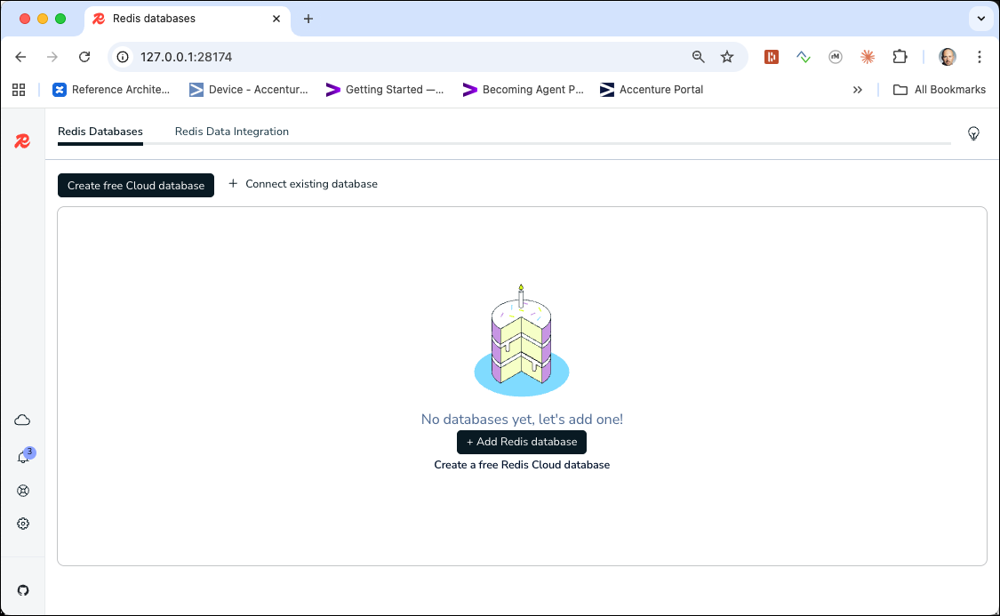
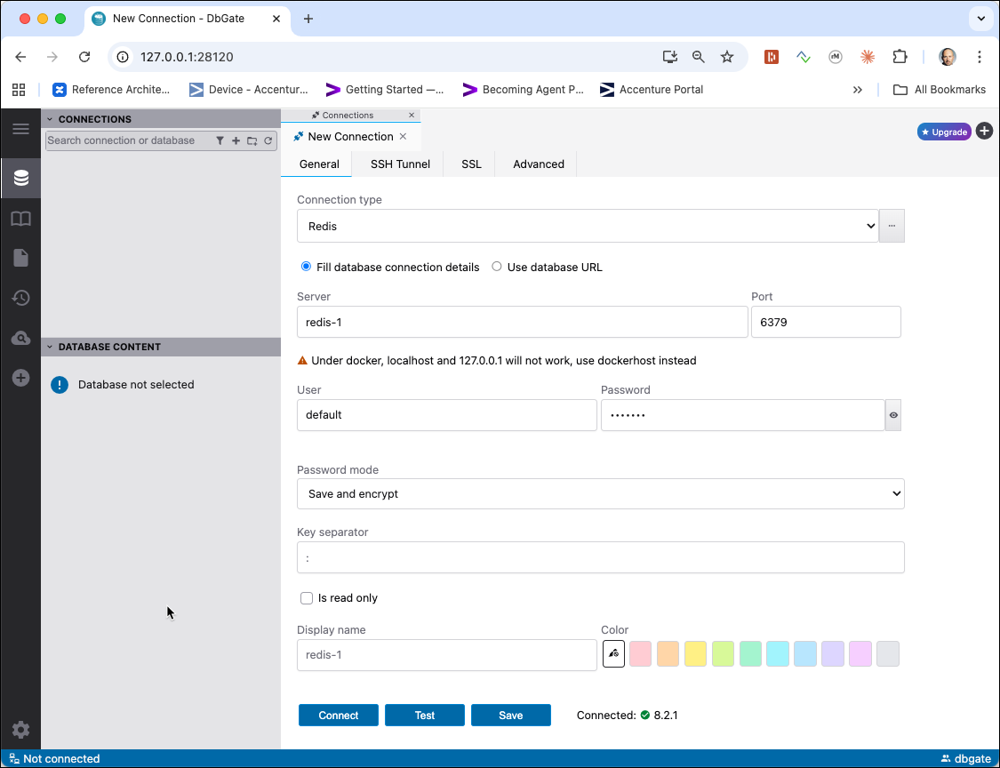
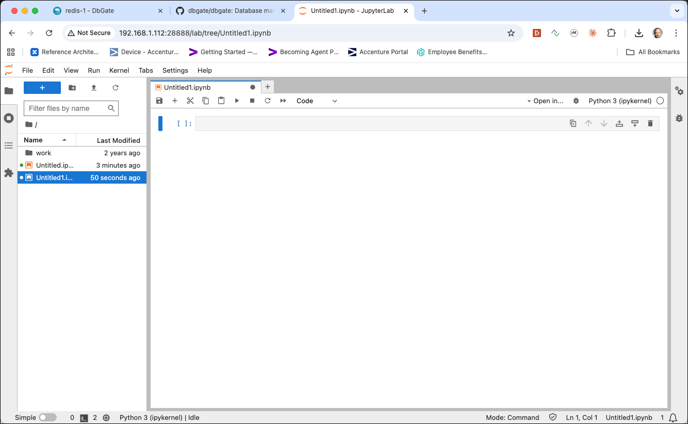

# Getting started with Redis

In this workshop we will learn the basics of working with Redis. We will be using Docker for initialising Redis in a container. 

## Table of Contents

- [What you will learn](#what-you-will-learn)
- [Prerequisites](#prerequisites)
- [Connecting to the Redis environment](#connecting-to-the-redis-environment)
- [String Data Structure](#string-data-structure)
- [List data structures](#list-data-structures)
- [Set data structures](#set-data-structures)
- [Sorted Set data structures](#sorted-set-data-structures)
- [Hash structures](#hash-structures)
- [Redis Benchmark](#redis-benchmark)
- [Working with Redis from Python](#working-with-redis-from-python)

## What you will learn

- How to connect to Redis using the command-line utility, Redis Commander, and Redis Insight
- How to work with String data structures (GET, SET, increment/decrement, expiration/TTL)
- How to work with Set data structures
- How to work with Sorted Set data structures
- How to work with Hash data structures
- How to benchmark Redis performance with the built-in benchmark tool
- How to interact with Redis using the Python API

## Prerequisites

- The **Data Platform** described [here](../01-environment) is running and accessible

## Connecting to the Redis environment

For connecting to Redis, we can either use the Redis Command Line Utility or the browser-based Redis Commander.

### Using the Redis Command Line utility

Open another terminal window and enter the following command to start Redis CLI in another docker container:

```
docker run -it --rm --network nosql-platform bitnamilegacy/redis:8.2 redis-cli -h redis-1 -p 6379
```

The Redis CLI should start and the following command prompt should appear (whereas the IP-Address can differ). 

```
redis 06:12:59.44 INFO  ==>
redis 06:12:59.45 INFO  ==> Welcome to the Bitnami redis container
redis 06:12:59.45 INFO  ==> Subscribe to project updates by watching https://github.com/bitnami/containers
redis 06:12:59.45 INFO  ==> NOTICE: Starting August 28th, 2025, only a limited subset of images/charts will remain available for free. Backup will be available for some time at the 'Bitnami Legacy' repository. More info at https://github.com/bitnami/containers/issues/83267
redis 06:12:59.45 INFO  ==>

redis-1:6379>
```

> **What you should see:** The `redis-1:6379>` prompt confirms the CLI has connected successfully to the Redis instance.

Redis is configured so that it requires authentication. You can use the `default` user, so only the password has to be passed with the `AUTH` command

```
AUTH default abc123!
```

> **What you should see:** Redis replies `OK`, confirming the password was accepted and the session is authenticated.

Enter help to see the version of Redis installed.

```
redis:6379> help
redis-cli 8.2.1
To get help about Redis commands type:
      "help @<group>" to get a list of commands in <group>
      "help <command>" for help on <command>
      "help <tab>" to get a list of possible help topics
      "quit" to exit

To set redis-cli preferences:
      ":set hints" enable online hints
      ":set nohints" disable online hints
Set your preferences in ~/.redisclirc
```

> **What you should see:** The redis-cli version number (e.g. `8.2.1`) and the help text listing available command groups.

### Using Redis Commander

In a web browser window, navigate to <http://dataplatform:28119>. You should see an image similar to the one shown below


> **What you should see:** The browser GUI showing the current keys stored in Redis, with a tree view on the left and a key inspector on the right.

### Using Redis Insight

In a web browser window, navigate to <http://dataplatform:28174>. You should see an image similar to the one shown below



> **What you should see:** The Redis Insight welcome screen with an option to add a new Redis database connection.

Click on **+ Add Redis database** and `redis://default@redis-1:6379` into the **Connection URL** field. Click on **Test Connection** to check the connection. If successfull, click on **Add Database**.

Click on the new connection `redis-1:6379` to connect to the redis instance.

### Using DbGate

**DbGate** is cross-platform database manager. It's designed to be simple to use and effective, when working with more databases simultaneously. 

In a browser window navigate to <http://dataplatform:28120/> and login in as user `dbgate` and password `abc123!`.

Click on the **+ Add new connection** under **CONNECTIONS**. 

Select `Redis` for the **Connection type** and enter the following values:

 * **Server**: `redis-1` 
 * **Port**: `6379`
 * **User**: `default`
 * **Password**: `abc123!`



Click **Test** to check that connection settings are valid and then click **Connect**. 

> **What you should see:** The DbGate web UI with the Redis connection listed under CONNECTIONS. If you expand it you will see the different Redis databases, with `db0` being the default database.

## String Data Structure

Enter the commands described in the following sections at the prompt. This can be done either using the Redis CLI or using the Redis Commander. 

```
HELP @STRING
```

###	Working with keys

Redis is what is called a key-value store, often referred to as a NoSQL database. The essence of a key-value store is the ability to store some data, called a value, inside a key. This data can later be retrieved only if we know the exact key used to store it. 

We can use the command `SET` to store the value “redis-server” at key “server:name”:

```
SET server:name "redis-server"
```

Redis will store our data permanently, so we can later ask _What is the value stored at key server:name_?

```
GET server:name 
```

and Redis will reply with “redis-server”.

> **What you should see:** Redis returns `”redis-server”`, confirming the value was stored and retrieved successfully.

```
EXISTS server:name
(integer) 1
```

> **What you should see:** `(integer) 1` — a return value of 1 means the key exists in Redis.

```
KEYS server*
1) "server:name"
```

```
KEYS *
1) "server:name"
```

### Get and Set operations

Other common operations provided by key-value stores are DEL to delete a given key and associated value, SET-if-not-exists (called SETNX on Redis) that sets a key only if it does not already exist, and INCR to atomically increment a number stored at a given key. So let's see some of these commands in action:

Let's first set a value at the key `connections` by using the `SET` command:

```
redis:6379> SET connections 10
OK
```

Let's check for the value by using the `GET` command:

```
redis:6379> GET connections
"10"
```

Now let's try if we can overwrite it by using another `SET` command:

```
redis:6379> SET connections 20
OK
redis:6379> GET connections
"20"
```

Let's see what happens if we are using the `SETNX` command. 

```
redis:6379> SETNX connections 30
(integer) 0
redis:6379> GET connections
"20"
```

> **What you should see:** `(integer) 0` — the key was NOT overwritten because it already existed; `GET` still returns `"20"`.
>
> **What just happened?** SETNX is "Set if Not eXists" — it only writes when the key is absent, making it safe for distributed locks where only one client should be able to claim the key.

if we are using `SETNX` on a key which does not yet exists, we get a different answer:

```
redis:6379> SETNX newkey 30
(integer) 1
```

Let's use `MSET` to set multiple key value pairs...

```
redis:6379> MSET key1 10 key2 20 key3 30
(integer) 1
```

and the oppposite `MGET` to get multiple values for multiple keys back. 

```
redis:6379> MGET key1 key3
1) "10"
2) "30"
```

> **What you should see:** Both values (`"10"` and `"30"`) returned in one response.
>
> **What just happened?** MGET is atomic — both values are fetched in a single server round-trip, unlike two separate GET calls which would each incur network latency.

**Note**: this is very much different to single `SET` and `GET` commands, as it it is done atomically in one operation. 

### Increment and Decrement operation

Now let's treat the value as a counter. 

First we initialise the connections value to 10, followed by a `INCR` to increment it by one. 
 
```
redis:6379> SET connections 10
OK
redis:6379> INCR connections 
(integer) 11
```

> **What you should see:** `(integer) 11` — the incremented value returned immediately.
>
> **What just happened?** INCR is an atomic operation — Redis increments and returns the new value in a single step, preventing race conditions that would occur if you read, modify, and write separately.

We can see that we get the new value of the counter back. 

Next we increase it by 10, using the `INCRBY` command. 

```
redis:6379> INCRBY connections 10
(integer) 21
```

Now let's do the opposite and decrement the counter value. First using the `DECR` command the counter is decremented by one. 

```
redis:6379> DECR connections
(integer) 20
```

and then with the `DECRBY` we can specify the decrement to use, here we use 10. 

```
redis:6379> DECRBY connections 10
(integer) 10
```

> **What you should see:** `(integer) 10` — the value after decrementing by 10.

Now let's delete the key/value pair and see what happens if we use `INCR` on a non-existing key. 

```
redis:6379> DEL connections
(integer) 1

redis:6379> EXISTS connections
(integer) 0

redis:6379> INCR connections
(integer) 1
```

> **What you should see:** `(integer) 1`.
>
> **What just happened?** Redis auto-initialises non-existing numeric keys to 0 before applying the operation, so INCR on a missing key always yields 1.

We can see that the `INCR` automatically starts with the value 0 and increments it by 1, which is the result we get back. 

----
**Note:** There is something special about INCR. Why do we provide such an operation if we can do it ourselves with a bit of code? After all it is as simple as:
x = GET count
x = x + 1
SET count x

The problem is that doing the increment in this way will only work as long as there is a single client using the key. See what happens if two clients are accessing this key at the same time:

  1.	Client A reads count as 10.
  2.	Client B reads count as 10.
  3.	Client A increments 10 and sets count to 11.
  4.	Client B increments 10 and sets count to 11.

We wanted the value to be 12, but instead it is 11! This is because incrementing the value in this way is not an atomic operation. Calling the `INCR` command in Redis will prevent this from happening, because it is an atomic operation. Redis provides many of these atomic operations on different types of data.

----

### Expiration and Time to Live

Redis can be told that a key should only exist for a certain length of time. This is accomplished with the `EXPIRE` and `TTL` commands.

First let's set a new key/value pair. 

```
redis:6379> SET resource:lock "Redis Demo"
OK
```

and then set it to expire after 2 minutes (120 seconds) by using the `EXPIRE` command.

```
redis:6379> EXPIRE resource:lock 120
(integer) 1
```

This sets the key `resource:lock` to be deleted in 120 seconds. You can test how long a key will exist for with the `TTL` command. It returns the number of seconds until it will be deleted.

```
redis:6379> TTL resource:lock
(integer) 96
```

> **What you should see:** A positive integer showing the remaining seconds until the key expires (the exact number will vary depending on how quickly you ran the command).

Waiting the 96 seconds and doing the same command again we can see that it has been deleted.

```
redis:6379> TTL resource:lock
(integer) -2
```

> **What you should see:** `(integer) -2` — this means the key has expired and been deleted.
>
> **What just happened?** Redis automatically deleted the key when its TTL reached zero — no manual cleanup needed.

The -2 for the TTL of the key count means that the key does (not/no longer) exist. We can prove it using the `EXISTS` command.

```
redis:6379> EXISTS resource:lock
(integer) 0
```

If you `SET` a key to a new value, its TTL will reset. Let's see that behaviour, by creating the value directly with an expiration time. This can either be done with the special `SETEX` or by `SET` and the option `EX`.  

```
redis:6379> SET resource:lock "Redis Demo 1" EX 120
OK
```

We can see that the time-to-live has been set upon creation. 

```
redis:6379> TTL resource:lock
(integer) 119
```

Now use the SET command to update the value

```
redis:6379> SET resource:lock "Redis Demo 2"
OK
```

We can see that the time-to-live has been cleared. 

```
redis:6379> TTL resource:lock
(integer) -1
```

> **What you should see:** `(integer) -1` — the key exists but has no expiry set.
>
> **What just happened?** Overwriting a key with `SET` (without an `EX` option) clears any previously set TTL, making the key persistent again.

Check the full list of [Srings commands](https://redis.io/commands#string) for more information.

##	List data structures

Redis also supports several more complex data structures. The first one we'll look at is a list. A list is a series of ordered values. Some of the important commands for interacting with lists are `RPUSH`, `LPUSH`, `LLEN`, `LRANGE`, `LPOP``, and RPOP. You can immediately begin working with a key as a list, as long as it doesn't already exist as a different type.

`RPUSH` puts the new value at the end of the list.

Let's add a new item to the end of a non-existing list called `skills` using the `RPUSH` command. 

```
redis:6379> RPUSH skills "Oracle RDBMS"
(integer) 1
```

We can see that the list now holds 1 item. Let's add another skill to the `skills` list. 

```
redis:6379> RPUSH skills "Redis"
(integer) 2
```

> **What you should see:** `(integer) 2` — the new length of the list after appending the second item.

Not let's see the values currently in the `skills` list. Can we use the `GET` command?

```
redis:6379> GET skills
(error) WRONGTYPE Operation against a key holding the wrong kind of value
```

> **What you should see:** A `WRONGTYPE` error message.
>
> **What just happened?** Redis enforces type safety per key — a key created as a List cannot be read with String commands. Each data type has its own command set.

The `GET` command belongs to the `String` group and cannot be used for `list` structures.
But we can use the `LRANGE` command for that. 

```
redis:6379> LRANGE skills 0 -1
1) "Oracle RDBMS"
2) "Redis"
``` 

> **What you should see:** All items in insertion order — `"Oracle RDBMS"` first, then `"Redis"`.

`LPUSH` puts the new value at the start of the list.

```
redis:6379> LPUSH skills "SQL Server"
(integer) 3
redis:6379> LRANGE skills 0 -1
1) "SQL Server"
2) "Oracle RDBMS"
3) "Redis"
```

`LRANGE` gives a subset of the list. It takes the index of the first element you want to retrieve as its first parameter and the index of the last element you want to retrieve as its second parameter. A value of -1 for the second parameter means to retrieve elements until the end of the list.

```
redis:6379> LRANGE skills 0 -1 
1) "SQL Server"
2) "Oracle RDBMS"
3) "Redis"
```

```
redis:6379> LRANGE skills 0 1 
1) "SQL Server"
2) "Oracle RDBMS"
```

```
redis:6379> LRANGE skills 1 2 
2) "Oracle RDBMS"
3) "Redis"
```

`LLEN` returns the current length of the list.

```
redis:6379> LLEN skills 
(integer) 3
```

`LPOP` removes the first element from the list and returns it.

```
redis:6379> LPOP skills 
"SQL Server"
```

`RPOP` removes the last element from the list and returns it.

```
redis:6379> RPOP skills 
"Redis"
```

**Note**: the list has now only one element left:

```
redis:6379> LLEN skills 
(integer) 1
redis:6379> LRANGE skills 0 -1
2) "Oracle RDBMS"
```

Check the full list of [List commands](https://redis.io/commands#list) for more information.

## Set data structures

The next data structure that we'll look at is the set. 

A set is similar to a list, except it does not have a specific order and each element may only appear once. Some of the important commands in working with sets are `SADD`, `SREM`, `SISMEMBER`, `SMEMBERS` and `SUNION`.

`SADD` adds the given value to the set. 

```
redis:6379> SADD nosql:products "Cassandra"
(integer) 1
redis:6379> SADD nosql:products "Redis"
(integer) 1
redis:6379> SADD nosql:products "MongoDB"
(integer) 1
```

`SMEMBERS` returns a list of all the members of this set.

```
redis:6379> SMEMBERS nosql:products
1) "Redis"
2) "Cassandra"
3) "MongoDB"
```

> **What you should see:** The three set members in arbitrary order — sets are unordered, so the output sequence may differ from what you see here.

`SREM` removes the given value from the set.


```
redis:6379> SREM nosql:products "MongoDB"
(integer) 1
redis:6379> SMEMBERS nosql:products
1) "Redis"
2) "Cassandra"
```

`SISMEMBER` tests if the given value is in the set.

```
redis:6379> SISMEMBER nosql:products "Cassandra"
(integer) 1
redis:6379> SISMEMBER nosql:products "MongoDB"
(integer) 0
```

> **What you should see:** `(integer) 1` for Cassandra (it is a member) and `(integer) 0` for MongoDB — 0 means not a member of the set.

Cassandra is a member of the nosql:products, but MongoDB is not (therefore the result of 0).

`SUNION` combines two or more sets and returns the list of all elements.

first let's create another set of RDBMS products:

```
redis:6379> SADD rdbms:products "Oracle"
(integer) 1
redis:6379> SADD rdbms:products "SQL Server"
(integer) 1
```

now create the union of the two:

```
redis:6379> SUNION rdbms:products nosql:products
1) "SQL Server"
2) "Cassandra"
3) "Redis"
4) "Oracle"
```

> **What you should see:** The combined unique elements from both sets (order may vary).
>
> **What just happened?** SUNION merges two sets and deduplicates — equivalent to a set union in mathematics. Any element present in either set appears exactly once in the result.

SUNIONSTORE combines two or more sets and stores the result into a new set.

```
redis:6379> SUNIONSTORE database:products rdbms:products nosql:products
(integer) 4
redis:6379> SMEMBERS database:products
1) "SQL Server"
2) "Cassandra"
3) "Redis"
4) "Oracle"
```

`SINTER` intersects two or more sets and returns the list of the intersecting elements.

```
redis:6379> SADD favorite:products "Cassandra"
(integer) 1
redis:6379> SADD favorite:products "Oracle"
(integer) 1

redis:6379> SINTER database:products favorite:products
1) "Cassandra"
2) "Oracle"
```

> **What you should see:** Only the elements present in both sets — `"Cassandra"` and `"Oracle"` (order may vary).
>
> **What just happened?** SINTER returns the intersection — only members that exist in every specified set. Elements unique to one set are excluded.

Check the full list of [Set commands](https://redis.io/commands#set) for more information.
   
## Sorted Set data structures
Sets are a very handy data type, but as they are unsorted they don't work well for a number of problems. This is why Redis 1.2 introduced Sorted Sets.
A sorted set is similar to a regular set, but now each value has an associated score. This score is used to sort the elements in the set.

`ZADD` adds one or more members to a sorted set, or update its score if it already exists.

```
redis:6379> ZADD pioneers 1940 "Alan Kay"
(integer) 1
redis:6379> ZADD pioneers 1906 "Grace Hopper"
(integer) 1
redis:6379> ZADD pioneers 1953 "Richard Stallman"
(integer) 1
redis:6379> ZADD pioneers 1965 "Yukihiro Matsumoto"
(integer) 1
redis:6379> ZADD pioneers 1916 "Claude Shannon"
(integer) 1
redis:6379> ZADD pioneers 1969 "Linus Torvalds"
(integer) 1
redis:6379> ZADD pioneers 1957 "Sophie Wilson"
(integer) 1
redis:6379> ZADD pioneers 1912 "Alan Turing"
(integer) 1
```

In these examples, the scores are years of birth and the values are the names of famous people in informatics.

`ZRANGE` returns a range of members in a sorted set by index (ordered low to high, e.g. ascending), optionally also returns the scores. Index starts with 0. 

```
redis:6379> ZRANGE pioneers 2 4
1) "Claude Shannon"
2) "Alan Kay"
3) "Richard Stallman"

redis:6379> ZRANGE pioneers 2 4 WITHSCORES
1) "Claude Shannon"
2) "1916"
3) "Alan Kay"
4) "1940"
5) "Richard Stallman"
6) "1953"
```

> **What you should see:** Names and birth years interleaved, sorted ascending by score (birth year).

`ZREVRANGE` returns a range of members in a sorted set by index (ordered high to low, e.g. descending), optionally also returns the scores. Index starts with 0. 

```
redis:6379> ZREVRANGE pioneers 0 2
1) "Linus Torvalds"
2) "Yukihiro Matsumoto"
3) "Sophie Wilson"
```

> **What you should see:** The three most recently born pioneers, ordered from highest birth year to lowest.

Check the full list of [Sorted Set commands](https://redis.io/commands#sorted_set) for more information.

## Hash structures

Simple strings, sets and sorted sets already get a lot done but there is one more data type Redis can handle: Hashes.

Hashes are maps between string fields and string values, so they are the perfect data type to represent objects (eg: A User with a number of fields like name, surname, age, and so forth):

`HSET` sets the field in the hash stored at the given key to a value. 

```
redis:6379> HSET user:1000 name "John Smith"
(integer) 1
redis:6379> HSET user:1000 email "john.smith@example.com"
(integer) 1
redis:6379> HSET user:1000 password "s3cret"
(integer) 1
```

To get back the saved data use `HGETALL` command:

```
redis:6379> HGETALL user:1000
1) "name"
2) "John Smith"
3) "email"
4) "john.smith@example.com"
5) "password"
6) "s3cret"
```

> **What you should see:** All field-value pairs stored in the hash for `user:1000`, returned as an alternating list of field names and values.

You can also set multiple fields at once using the `HMSET` command. 

```
redis:6379> HMSET user:1001 name "Mary Jones" password "hidden" email "mjones@example.com"
OK
```

let's see that this worked and a new hash as been created.

```
redis:6379> HGETALL user:1001
1) "name"
2) "Mary Jones"
3) "password"
4) "hidden"
5) "email"
6) "mjones@example.com"
```

If you only need a single field value that is possible as well using the `HGET` command

```
redis:6379> HGET user:1001 name
"Mary Jones"
```

Numerical values in hash fields are handled exactly the same as in simple strings and there are operations to increment this value in an atomic way.


```
redis:6379> HSET user:1000 visits 10
(integer) 1
redis:6379> HINCRBY user:1000 visits 1
(integer) 11
redis:6379> HINCRBY user:1000 visits 10
(integer) 21
redis:6379> HDEL user:1000 visits
(integer) 1
```

> **What you should see:** `(integer) 11` after the first HINCRBY, then `(integer) 21` after incrementing by 10.
>
> **What just happened?** HINCRBY atomically increments a numeric field inside a hash — the same atomicity guarantee as INCR on strings, preventing race conditions in concurrent access scenarios.
    
Check the full list of [Hash commands](https://redis.io/commands#hash) for more information.

## Redis Benchmark

Redis ships with a built-in benchmarking tool called `redis-benchmark`. It simulates a number of clients sending commands in parallel and reports the throughput (requests/second) for each command type. This is useful for understanding the performance characteristics of your Redis deployment and for comparing the effect of different configurations.

### Running a basic benchmark

Run the benchmark tool from a temporary Docker container on the same Docker network as Redis:

```bash
docker run -it --rm --network nosql-platform bitnamilegacy/redis:8.2 redis-benchmark -h redis-1 -p 6379 -n 100000 -q
```

The key flags used here are:

| Flag | Description |
|------|-------------|
| `-h redis-1` | Hostname of the Redis server |
| `-p 6379` | Port of the Redis server |
| `-n 100000` | Total number of requests to send per test |
| `-q` | Quiet mode — only prints the summary line (ops/sec) per command |

You should see output similar to the following (exact numbers will vary depending on your hardware):

```
PING_INLINE: 142653.36 requests per second, p50=0.175 msec
PING_MBULK: 153139.53 requests per second, p50=0.167 msec
SET: 137931.03 requests per second, p50=0.183 msec
GET: 149253.73 requests per second, p50=0.175 msec
INCR: 147058.83 requests per second, p50=0.175 msec
LPUSH: 138696.25 requests per second, p50=0.183 msec
RPUSH: 140845.08 requests per second, p50=0.183 msec
LPOP: 147058.83 requests per second, p50=0.175 msec
RPOP: 149700.60 requests per second, p50=0.175 msec
SADD: 142450.14 requests per second, p50=0.175 msec
HSET: 140449.44 requests per second, p50=0.183 msec
SPOP: 147275.41 requests per second, p50=0.175 msec
ZADD: 135685.22 requests per second, p50=0.191 msec
ZPOPMIN: 145772.59 requests per second, p50=0.175 msec
LRANGE_100: 56818.18 requests per second, p50=0.343 msec
LRANGE_300: 24813.90 requests per second, p50=0.663 msec
LRANGE_500: 16155.09 requests per second, p50=1.015 msec
LRANGE_600: 13550.14 requests per second, p50=1.183 msec
MSET (10 keys): 115473.44 requests per second, p50=0.223 msec
XADD: 139860.14 requests per second, p50=0.183 msec
```

> **What you should see:** One line per command showing the throughput in requests per second and the p50 (median) latency. Higher requests/second means better throughput; lower latency is better.

### Running a more verbose benchmark

Remove the `-q` flag to get detailed per-percentile latency histograms for each command:

```bash
docker run -it --rm --network nosql-platform bitnamilegacy/redis:8.2 redis-benchmark -h redis-1 -p 6379 -n 100000
```

You will see output like this for each command:

```
====== SET ======
  100000 requests completed in 0.72 seconds
  50 parallel clients
  3 bytes payload
  keep alive: 1
  host configuration "save": 3600 1 300 100 60 10000
  host configuration "appendonly": no
  multi-thread: no

Latency by percentile distribution:
0.000% <= 0.071 milliseconds (cumulative count 1)
50.000% <= 0.183 milliseconds (cumulative count 50753)
75.000% <= 0.199 milliseconds (cumulative count 75536)
87.500% <= 0.215 milliseconds (cumulative count 87952)
93.750% <= 0.239 milliseconds (cumulative count 93795)
96.875% <= 0.279 milliseconds (cumulative count 96900)
98.438% <= 0.335 milliseconds (cumulative count 98440)
99.219% <= 0.415 milliseconds (cumulative count 99226)
99.609% <= 0.487 milliseconds (cumulative count 99615)
99.805% <= 0.559 milliseconds (cumulative count 99805)
99.902% <= 0.623 milliseconds (cumulative count 99902)
99.951% <= 0.671 milliseconds (cumulative count 99952)
99.976% <= 0.711 milliseconds (cumulative count 99977)
99.988% <= 0.743 milliseconds (cumulative count 99989)
99.994% <= 0.767 milliseconds (cumulative count 99994)
99.997% <= 0.791 milliseconds (cumulative count 99997)
99.998% <= 0.807 milliseconds (cumulative count 99999)
99.999% <= 0.815 milliseconds (cumulative count 100000)
100.000% <= 0.815 milliseconds (cumulative count 100000)

Cumulative distribution of latencies:
2.500% <= 0.103 milliseconds (cumulative count 2500)
95.000% <= 0.255 milliseconds (cumulative count 95000)
99.000% <= 0.383 milliseconds (cumulative count 99000)
99.900% <= 0.607 milliseconds (cumulative count 99900)
100.000% <= 0.815 milliseconds (cumulative count 100000)

Summary:
  throughput summary: 137931.03 requests per second
  latency summary (msec):
          avg       min       p50       p95       p99      p99.9
        0.191     0.064     0.183     0.255     0.383     0.599
```

### Benchmarking specific commands

Use the `-t` flag to benchmark only specific commands (comma-separated):

```bash
docker run -it --rm --network nosql-platform bitnamilegacy/redis:8.2 redis-benchmark -h redis-1 -p 6379 -n 100000 -t set,get,incr -q
```

```
SET: 140845.08 requests per second, p50=0.183 msec
GET: 149700.60 requests per second, p50=0.175 msec
INCR: 146198.83 requests per second, p50=0.175 msec
```

> **What you should see:** Throughput numbers only for the three specified commands.

### Effect of concurrent connections

The `-c` flag controls the number of parallel client connections (default is 50). Increasing it can reveal throughput gains from parallelism or expose contention:

```bash
docker run -it --rm --network nosql-platform bitnamilegacy/redis:8.2 redis-benchmark -h redis-1 -p 6379 -n 100000 -c 10 -t set,get -q
```

```
SET: 120000.00 requests per second, p50=0.255 msec
GET: 122000.00 requests per second, p50=0.247 msec
```

Now increase to 200 connections:

```bash
docker run -it --rm --network nosql-platform bitnamilegacy/redis:8.2 redis-benchmark -h redis-1 -p 6379 -n 100000 -c 200 -t set,get -q
```

```
SET: 158000.00 requests per second, p50=0.655 msec
GET: 162000.00 requests per second, p50=0.639 msec
```

> **What you should see:** Higher throughput at 200 connections compared to 10, but also higher latency. This demonstrates the throughput vs. latency trade-off under concurrency.

### Effect of payload size

The `-d` flag controls the size of the value in bytes used for SET/GET tests (default is 3 bytes). Larger payloads take more time to serialise and transmit:

```bash
docker run -it --rm --network nosql-platform bitnamilegacy/redis:8.2 redis-benchmark -h redis-1 -p 6379 -n 100000 -d 64 -t set,get -q
```

```
SET: 138000.00 requests per second, p50=0.191 msec
GET: 148000.00 requests per second, p50=0.183 msec
```

Try a larger payload of 1024 bytes (1 KB):

```bash
docker run -it --rm --network nosql-platform bitnamilegacy/redis:8.2 redis-benchmark -h redis-1 -p 6379 -n 100000 -d 1024 -t set,get -q
```

```
SET: 126000.00 requests per second, p50=0.207 msec
GET: 134000.00 requests per second, p50=0.199 msec
```

> **What you should see:** A small but measurable drop in throughput as payload size increases, because Redis must read and write more bytes per operation.

### Effect of pipelining

Pipelining batches multiple commands into a single network round trip. The `-P` flag sets the number of commands per pipeline batch (default is 1, i.e. no pipelining):

```bash
docker run -it --rm --network nosql-platform bitnamilegacy/redis:8.2 redis-benchmark -h redis-1 -p 6379 -n 100000 -P 16 -t set,get -q
```

```
SET: 952380.94 requests per second, p50=0.263 msec
GET: 999000.00 requests per second, p50=0.255 msec
```

> **What you should see:** A dramatic increase in throughput — often 5–10x or more — because each network round trip now carries 16 commands instead of 1.
>
> **What just happened?** Pipelining removes the per-command network round-trip overhead. This is the single biggest performance lever available at the client level and is commonly used in batch-write scenarios.

### Exporting results as CSV

Use `--csv` to produce machine-readable output suitable for loading into a spreadsheet or monitoring tool:

```bash
docker run -it --rm --network nosql-platform bitnamilegacy/redis:8.2 redis-benchmark -h redis-1 -p 6379 -n 100000 -t set,get,incr -q --csv
```

```
"SET","140845.07"
"GET","149700.60"
"INCR","146198.83"
```

> **What you should see:** One CSV line per tested command with the command name and its throughput in requests per second.

## Working with Redis from Python

The `redis-py` library is the standard Python client for Redis. In this section we will connect to Redis from the **Jupyter** environment and reproduce the same operations we performed in the CLI sections above.

Open a browser and navigate to <http://dataplatform:28888> and login it with token `abc123!`.
 
Create a new Python 3 notebook by clicking on the Python 3 (ipykernel) widget. 


A new notebook will be created with a first cell available to execute commands. 



Then work through the cells below in order.

### Cell 1 — Install the library

```python
import sys
!{sys.executable} -m pip install redis
```

> **What you should see:** pip output ending with `Successfully installed redis-...`.

### Cell 2 — Connect to Redis

```python
import redis

r = redis.Redis(host='redis-1', port=6379, db=0, decode_responses=True)
r.ping()
```

> **What you should see:** `True` — the client successfully reached Redis and received a `PONG` response.

`decode_responses=True` tells the client to return Python strings instead of raw bytes, which makes notebook output much easier to read.

### Cell 3 — String operations

The Python method names map directly onto the Redis commands you already know:

```python
# SET and GET
r.set('server:name', 'redis-server')
print(r.get('server:name'))           # redis-server

# Key existence
print(r.exists('server:name'))        # 1

# SET with expiration (EX = seconds)
r.set('resource:lock', 'Redis Demo', ex=120)
print(r.ttl('resource:lock'))         # ~120

# SETNX — only set if the key does not exist
r.set('connections', 20)
print(r.setnx('connections', 30))     # False — key already exists
print(r.get('connections'))           # 20

# MSET / MGET
r.mset({'key1': 10, 'key2': 20, 'key3': 30})
print(r.mget('key1', 'key3'))         # ['10', '30']
```

> **What you should see:** Each `print` call returns the value described in the inline comment.

### Cell 4 — Increment and Decrement

```python
r.set('connections', 10)
print(r.incr('connections'))          # 11
print(r.incrby('connections', 10))    # 21
print(r.decr('connections'))          # 20
print(r.decrby('connections', 10))    # 10

# INCR on a non-existing key starts from 0
r.delete('connections')
print(r.incr('connections'))          # 1
```

### Cell 5 — List operations

```python
# Delete the key first so we start clean
r.delete('skills')

# RPUSH appends to the end; LPUSH prepends to the front
r.rpush('skills', 'Oracle RDBMS')
r.rpush('skills', 'Redis')
r.lpush('skills', 'SQL Server')

# LRANGE — retrieve all items (0 to -1 means the full list)
print(r.lrange('skills', 0, -1))      # ['SQL Server', 'Oracle RDBMS', 'Redis']
print(r.llen('skills'))               # 3

# LPOP / RPOP — remove and return from either end
print(r.lpop('skills'))               # SQL Server
print(r.rpop('skills'))               # Redis
print(r.lrange('skills', 0, -1))      # ['Oracle RDBMS']
```

### Cell 6 — Set operations

```python
r.delete('nosql:products', 'rdbms:products', 'favorite:products')

r.sadd('nosql:products', 'Cassandra', 'Redis', 'MongoDB')
r.sadd('rdbms:products', 'Oracle', 'SQL Server')

print(r.smembers('nosql:products'))   # {'Cassandra', 'Redis', 'MongoDB'}

r.srem('nosql:products', 'MongoDB')
print(r.sismember('nosql:products', 'Cassandra'))   # True
print(r.sismember('nosql:products', 'MongoDB'))     # False

# SUNION — union of two sets
print(r.sunion('nosql:products', 'rdbms:products'))
# {'Cassandra', 'Redis', 'Oracle', 'SQL Server'}

# SINTER — intersection
r.sadd('favorite:products', 'Cassandra', 'Oracle')
print(r.sinter('nosql:products', 'favorite:products'))  # {'Cassandra'}
```

> **What you should see:** Set membership results matching the comments. The order of set elements may vary — sets are unordered.

### Cell 7 — Sorted Set operations

```python
r.delete('pioneers')

pioneers = {
    'Alan Kay':           1940,
    'Grace Hopper':       1906,
    'Richard Stallman':   1953,
    'Yukihiro Matsumoto': 1965,
    'Claude Shannon':     1916,
    'Linus Torvalds':     1969,
    'Sophie Wilson':      1957,
    'Alan Turing':        1912,
}
r.zadd('pioneers', pioneers)

# ZRANGE — ascending by score (birth year), indices 2 to 4, with scores
print(r.zrange('pioneers', 2, 4, withscores=True))
# [('Claude Shannon', 1916.0), ('Alan Kay', 1940.0), ('Richard Stallman', 1953.0)]

# ZREVRANGE — highest scores first, first 3 results
print(r.zrevrange('pioneers', 0, 2))
# ['Linus Torvalds', 'Yukihiro Matsumoto', 'Sophie Wilson']
```

### Cell 8 — Hash operations

```python
r.delete('user:1000', 'user:1001')

# HSET — set individual fields
r.hset('user:1000', 'name',     'John Smith')
r.hset('user:1000', 'email',    'john.smith@example.com')
r.hset('user:1000', 'password', 's3cret')

# HGETALL — retrieve all fields at once
print(r.hgetall('user:1000'))
# {'name': 'John Smith', 'email': 'john.smith@example.com', 'password': 's3cret'}

# HSET with mapping= — set multiple fields in one call
r.hset('user:1001', mapping={
    'name':     'Mary Jones',
    'password': 'hidden',
    'email':    'mjones@example.com',
})
print(r.hget('user:1001', 'name'))    # Mary Jones

# HINCRBY — atomic increment of a numeric hash field
r.hset('user:1000', 'visits', 10)
print(r.hincrby('user:1000', 'visits', 1))    # 11
print(r.hincrby('user:1000', 'visits', 10))   # 21
r.hdel('user:1000', 'visits')
```

### Cell 9 — Bulk writes with a pipeline

Just like `redis-benchmark -P` batches commands, `redis-py` has a pipeline API that sends multiple commands in a single round trip:

```python
pipe = r.pipeline()

for i in range(1000):
    pipe.set(f'bulk:key:{i}', i)

pipe.execute()                        # all 1000 SETs sent in one round trip
print(r.get('bulk:key:42'))           # 42
```

> **What you should see:** `'42'` printed after the pipeline executes.
>
> **What just happened?** `pipeline()` buffers commands locally and flushes them all at once when `execute()` is called, eliminating per-command network latency — the Python equivalent of the pipelining you measured with `redis-benchmark -P`.

### Cell 10 — Cleaning up

Remove all keys created during this section:

```python
pattern_groups = ['bulk:key:*', 'user:*', 'pioneers', 'skills',
                  'nosql:products', 'rdbms:products', 'favorite:products',
                  'server:name', 'resource:lock', 'connections',
                  'key1', 'key2', 'key3']

keys_to_delete = []
for pattern in pattern_groups:
    keys_to_delete.extend(r.keys(pattern))

if keys_to_delete:
    r.delete(*keys_to_delete)
    print(f'Deleted {len(keys_to_delete)} keys.')
else:
    print('Nothing to delete.')
```

> **What you should see:** `Deleted N keys.` confirming all workshop keys have been removed.

