# Working with Neo4J

In this workshop we will learn how to use the Neo4J NoSQL database.

We assume that the platform described [here](../01-environment/README.md) is running and accessible. 

In this workshop you learn how to use Neo4J for querying, visualisation, and data interaction. [Neo4J Browser](https://neo4j.com/developer/guide-neo4j-browser/) is part of Neo4J and offers a browser-based interface for adding data, running queries, creating relationships, and more. It also provides an easy way to visualise the data in the database.

## Table of Contents

- [What you will learn](#what-you-will-learn)
- [Prerequisites](#prerequisites)
- [Connecting to the Cypher Shell (optional)](#connecting-to-the-cypher-shell-optional)
- [Connecting with Neo4J Browser](#connecting-with-neo4j-browser)
- [Loading the Movie Graph](#loading-the-movie-graph)
- [Example Queries](#example-queries)

## What you will learn

- How to connect to Neo4J using the Cypher Shell and the Neo4J Browser
- How to load the built-in Movie Graph dataset
- How to explore graph data visually in the Neo4J Browser
- How to write Cypher queries to traverse and analyse relationships in a graph

## Prerequisites

- The **Data Platform** described [here](../01-environment/README.md) is running and accessible

## Connecting to the Cypher Shell (optional)

To use the `cypher-shell`, in a terminal window execute

```bash
docker exec -ti neo4j-1 ./bin/cypher-shell -u neo4j -p abc123abc123
```

and you should get the Neo4J command prompt:

```bash
eadp@eadp-virtual-machine:~$ docker exec -ti neo4j-1 ./bin/cypher-shell -u neo4j -p abc123abc123
Connected to Neo4j using Bolt protocol version 6.0 at neo4j://localhost:7687 as user neo4j.
Type :help for a list of available commands or :exit to exit the shell.
Note that Cypher queries must end with a semicolon.
neo4j@neo4j>
```

> **What you should see:** the `neo4j@neo4j>` prompt confirming a successful connection over the Bolt protocol.

Type `:help` to get a list of available commands 

```bash
neo4j@neo4j> :help

Available commands:
  :access-mode View or set access mode
  :begin       Open a transaction
  :commit      Commit the currently open transaction
  :connect     Connects to a database
  :disconnect  Disconnects from database
  :exit        Exit the logger
  :help        Show this help message
  :history     Statement history
  :impersonate Impersonate user
  :param       Set the value of a query parameter
  :rollback    Rollback the currently open transaction
  :source      Executes Cypher statements from a file
  :sysinfo     Neo4j system information
  :use         Set the active database

For help on a specific command type:
    :help command

Keyboard shortcuts:
    Up and down arrows to access statement history.
    Tab for autocompletion of commands, hit twice to select suggestion from list using arrow keys.

For help on cypher please visit:
    https://neo4j.com/docs/cypher-manual/current/
```

> **What you should see:** the list of available shell commands such as `:begin`, `:commit`, `:connect`, `:exit`, `:help`, and others, along with keyboard shortcuts and a link to the Cypher manual.

You can also execute any valid Cypher statements. 

Enter `:exit` to leave the CLI.

For the workshop we will be using Neo4J Browser, as it includes an easy way to load a tutorial database.

## Connecting with Neo4J Browser

In a browser window, navigate to <http://dataplatform:7474> and you should directly land on the Neo4j Browser login screen. 

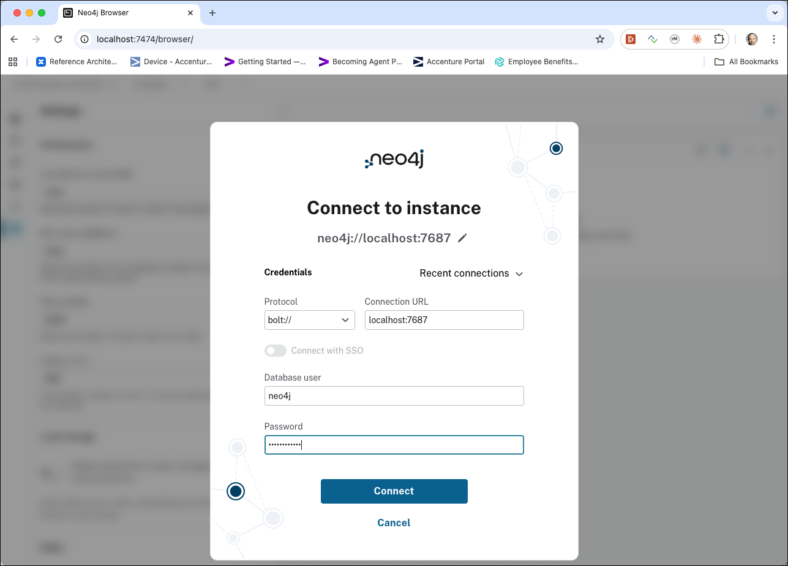

> **What you should see:** the login form with a Connect URL field, a Username field, and a Password field.

Enter `bolt://dataplatform:7687` into the **Connect URL**, `neo4j` into the **Username** and `abc123abc123` into the **Password** field and click **Connect**. 

If successfully connected, you should see a page similar to the one shown below:

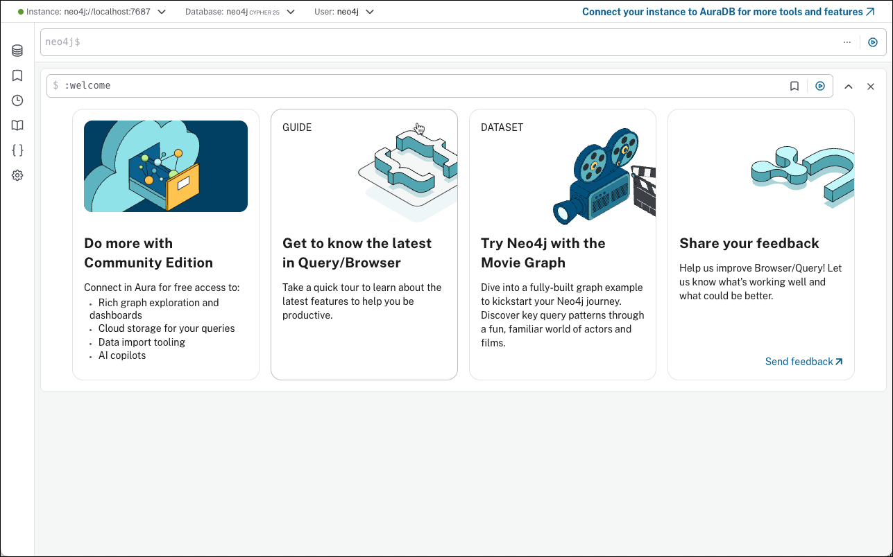

> **What you should see:** the Neo4J Browser home page with a command bar at the top and an empty canvas below.
 
## Loading the Movie Graph

Neo4J comes with some predefined tutorials, which provide an easy way for loading some data into the graph and then using that graph to exercise the query capabilities of the graph. 

Click on the **Try Neo4j with the Movie Graph** widget. 

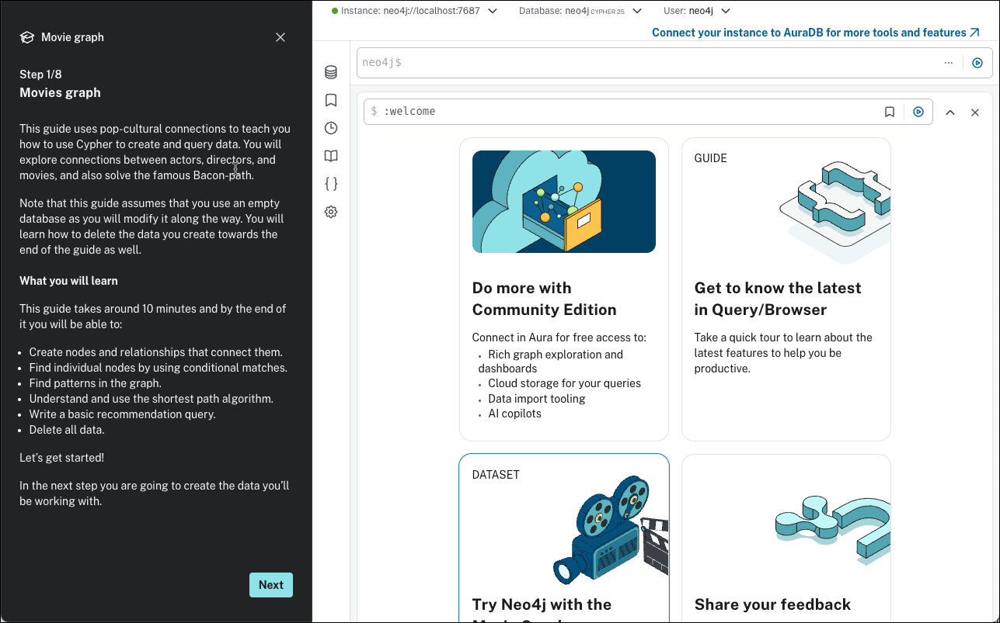

> **What you should see:** a tutorial panel shows up on the left of the homescreen describing the Movie Graph dataset tutorial.

Click **Next** and to navigate to page **2/8**

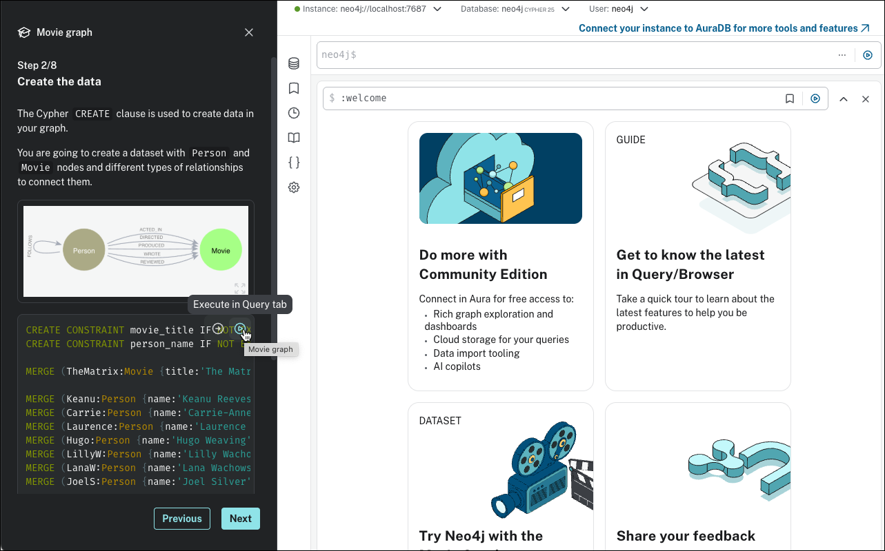

> **What you should see:** step 2/8 of the tutorial showing a CREATE and MERGE statement that builds the full movie graph.

Click on the play arrow and multiple merge query statement will be executed to insert the movie data into the graph. 

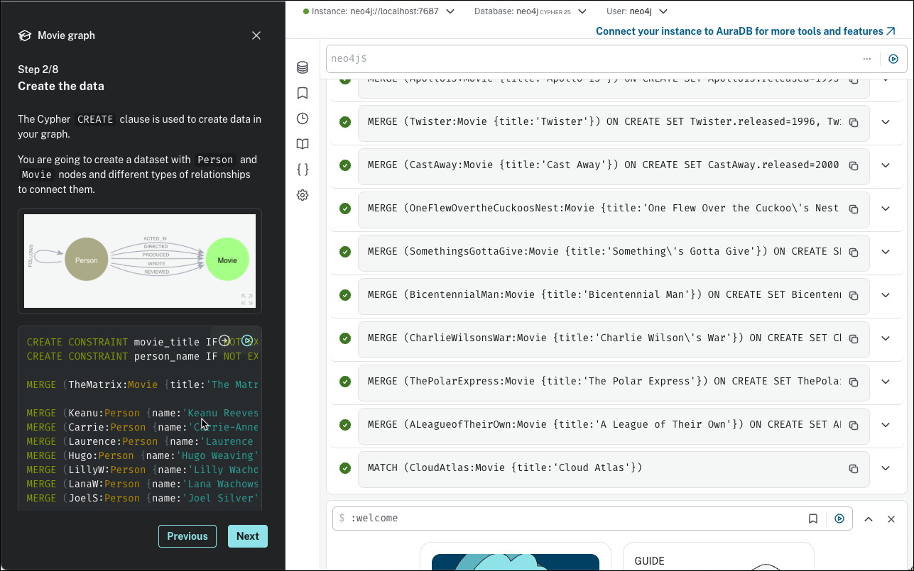

> **What you should see:** the statements will be executed one by one.

## Indexes and Constraints

Click on **Next** in the navigation bar on the bottom of the panel to navigate to **3/8**. Execute the `SHOW INDEXES` commannd

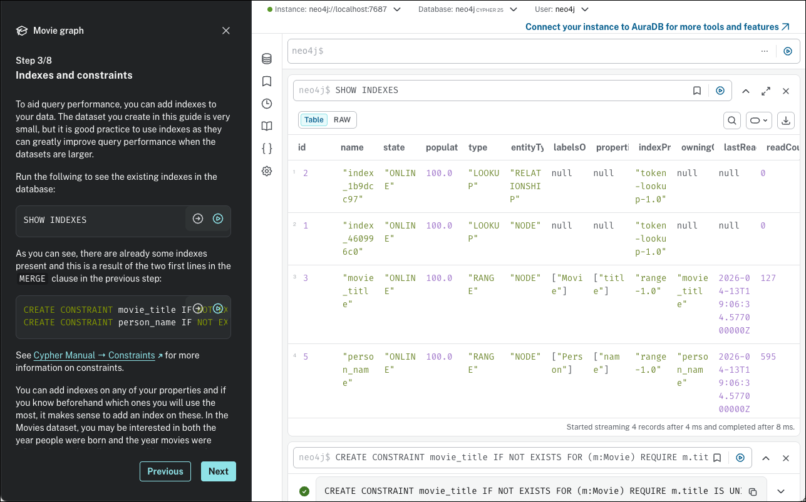

> **What you should see:**  There are already some indexes present and this is a result of the two first lines in the MERGE clause in the previous step.

## Viewing the Database

Before continuing with the next step, let's see how the graph looks like. Click on the database icon on the top left corner of the Neo4J browser.

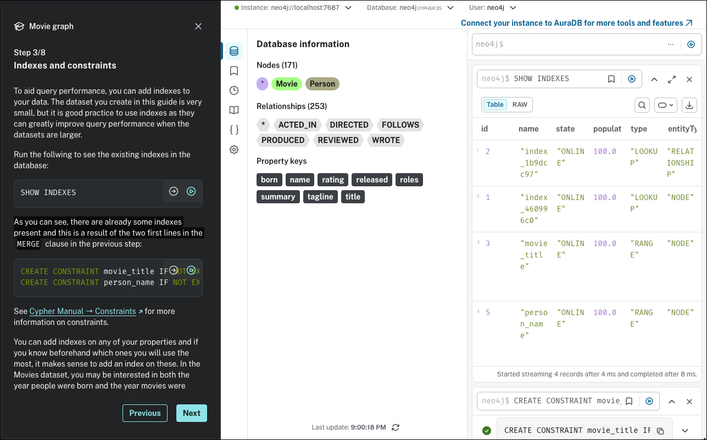

> **What you should see:** a sidebar listing Node Labels (Movie, Person), Relationship Types (ACTED_IN, DIRECTED, etc.) and Property Keys, each with a count.

> **What just happened?** the CREATE statement inserted all the movie nodes and person nodes and the relationships between them into the Neo4J graph database.

## Example Queries

Navigate to step **4/8** to find some Cipher statements for finding the information in the graph.

The first statement, finds the actor named "Tom Hanks"

```
MATCH (p:Person {name: "Tom Hanks"})
RETURN p
```

Click on the **->** icon to **Edit in Cypher Editor**.

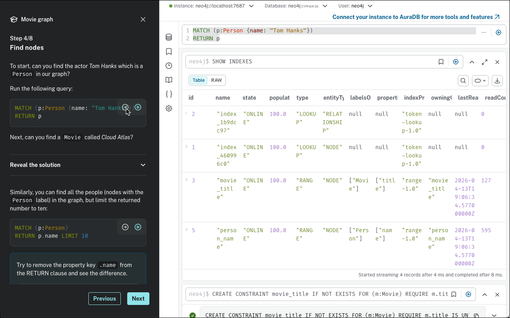

Execute it and see the result in a graphical way. 

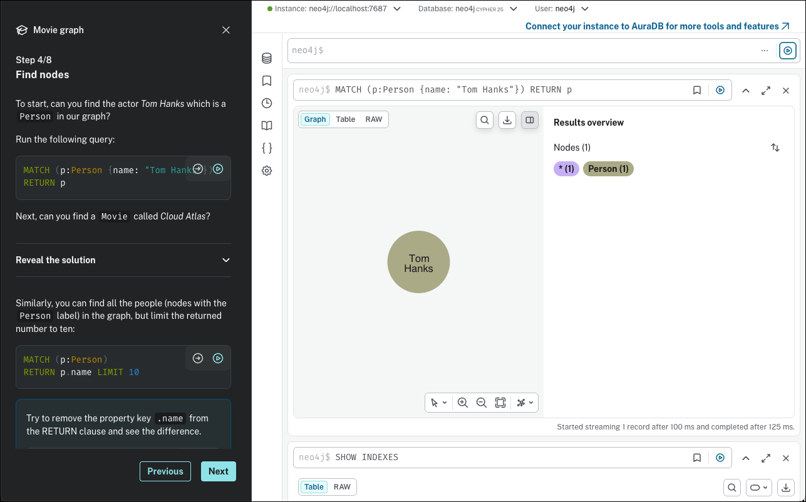

> **What you should see:** a single Person node labelled "Tom Hanks" is displayed on the canvas.

> **What just happened?** MATCH found the node whose `name` property equals "Tom Hanks" and RETURN rendered it as a visual node.

We have only matched on a single Person, therefore only a single node is shown. 

Not let's find the movie with title "Cloud Atlas"...

```
MATCH (cloudAtlas {title: "Cloud Atlas"}) RETURN cloudAtlas
```

The result is similar to the one before, but this time another type of node, a **Movie** node is returned and that's why it is shown in another color.

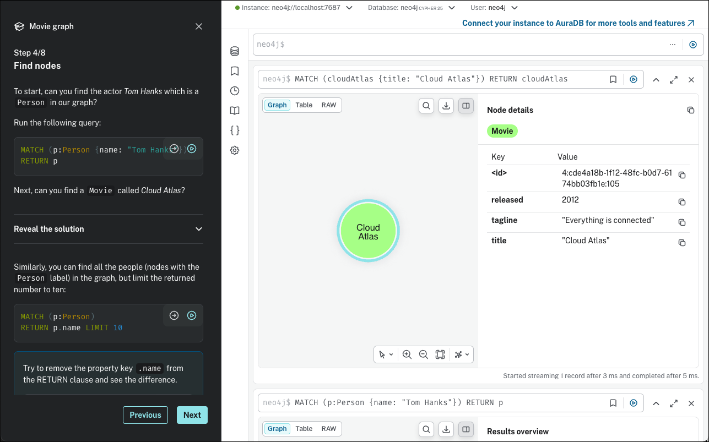

Double click on a node and expand the relationship from/to the **Cloud Atlas** movie node.

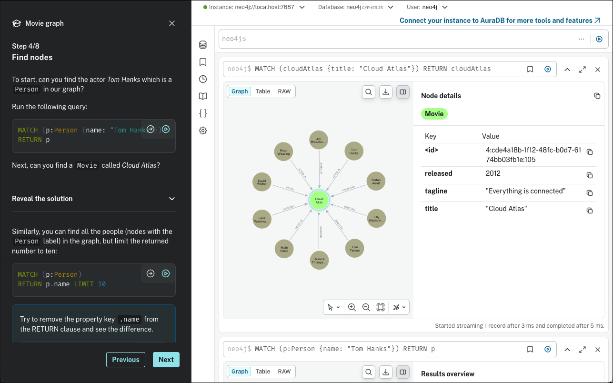

> **What you should see:** all Person nodes that have a relationship to the Cloud Atlas movie node, connected by labelled edges.

> **What just happened?** Neo4J traversed every relationship connected to the Cloud Atlas node and rendered the neighbouring nodes on the canvas.

We can see that these are all of type Person (shown by all having the same color). 

Continue with the other statements on the step **5/8** panel and then continue with the other panels. 

You will see many interesting queries, showing the power of a graph database, such as

Show Tom Hanks' co-actors:

```
MATCH (tom:Person {name:"Tom Hanks"})-[:ACTED_IN]->(m)<-[:ACTED_IN]-(coActors) RETURN coActors.name
```

> **What you should see:** a list of actor names who appeared in at least one movie alongside Tom Hanks.

> **What just happened?** the pattern `(tom)-[:ACTED_IN]->(m)<-[:ACTED_IN]-(coActors)` navigates two hops through the graph — from Tom Hanks to movies he acted in, then back out to all other actors in those same movies.

or the Bacon path, the shortest path of any relationships to Meg Ryan

```
MATCH p=shortestPath(
(bacon:Person {name:"Kevin Bacon"})-[*]-(meg:Person {name:"Meg Ryan"})
)
RETURN p
```

the result will show the shortest path from Kevin Bacon to Meg Ryan

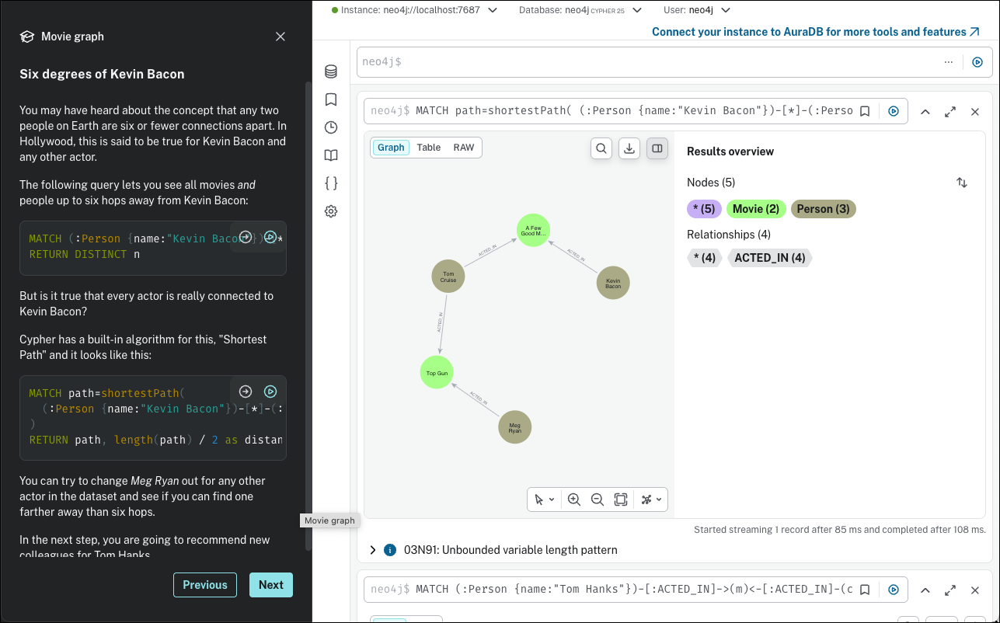

> **What you should see:** a chain of nodes and relationships showing the shortest sequence of connections between Kevin Bacon and Meg Ryan.

> **What just happened?** `shortestPath` ran a breadth-first search through the graph and returned the minimum-hop path between the two people — the foundation of the "Six Degrees of Kevin Bacon" game.


