# Working with GraphDB

In this workshop we will learn how to use the Ontotext GraphDB NoSQL database.

We assume that the platform described [here](../01-environment/README.md) is running and accessible. 

In this workshop you learn how to load RDF data into GraphDB and then use the SPARQL query language to query the data.

## What you will learn

- How to create a repository in GraphDB Workbench
- How to load RDF data in Turtle format from a URL into GraphDB
- How to explore the class hierarchy and visualise the graph in the GraphDB Workbench
- How to write SPARQL queries to retrieve, filter, join, and aggregate RDF graph data

## Prerequisites

- The **Data Platform** described [here](../01-environment/README.md) is running and accessible

## Background: RDF and Turtle format

GraphDB is an RDF triple store. RDF (Resource Description Framework) models data as a collection of **triples**, each consisting of:

- **Subject** — the resource being described (identified by a URI)
- **Predicate** — the property or relationship
- **Object** — the value or another resource

For example, the triple `imdb:title/TheMatrix schema:name "The Matrix"` states that the resource `TheMatrix` has the name "The Matrix".

Turtle (`.ttl`) is a compact, human-readable syntax for writing RDF data. A short example looks like this:

```turtle
@prefix schema: <http://schema.org/> .
@prefix imdb:   <http://academy.ontotext.com/imdb/> .

imdb:title/TheMatrix a imdb:ColorMovie ;
    schema:name "The Matrix" ;
    schema:director imdb:person/LanaWachowski .
```

The `a` keyword is shorthand for `rdf:type`. Multiple predicates for the same subject are separated by `;`.

## Loading RDF data

We will use the Movies data taken from a tutorial provided by GraphDB. The data is available in Turtle syntax in the GitHub project under this link <https://raw.githubusercontent.com/gschmutz/nosql-workshop/master/07-working-with-graphdb/data/movies.ttl>. If you click on the link you will see the data as shown below 


We will use the GraphDB workbench to load the data. In a browser, navigate to <http://dataplatform:17200> to open the GraphDB workbench.

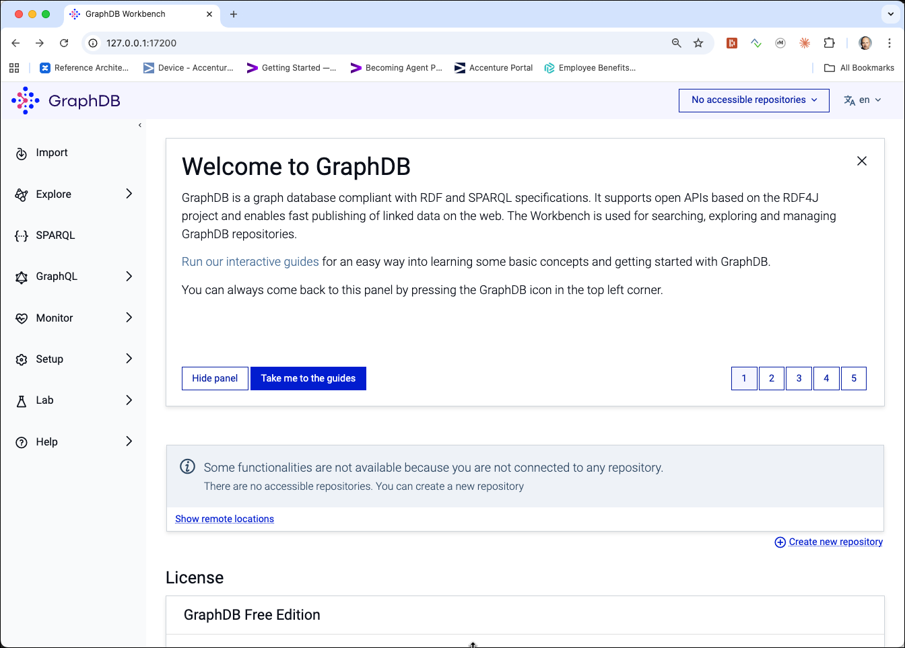

Click on **Create new repository** and select **GraphDB Repository**.

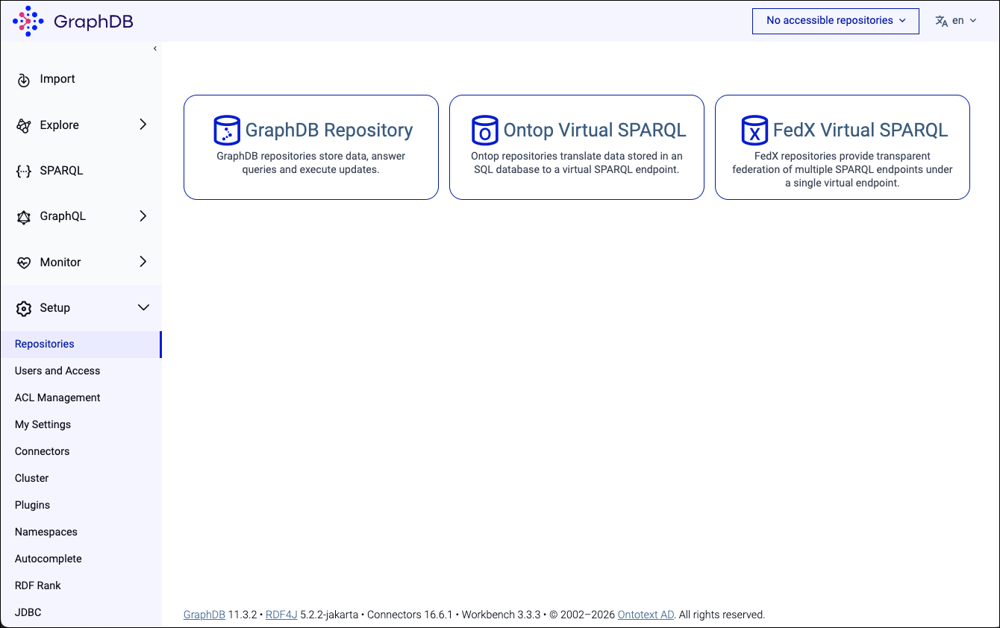

Enter `Movies` into the **Repository ID** field 

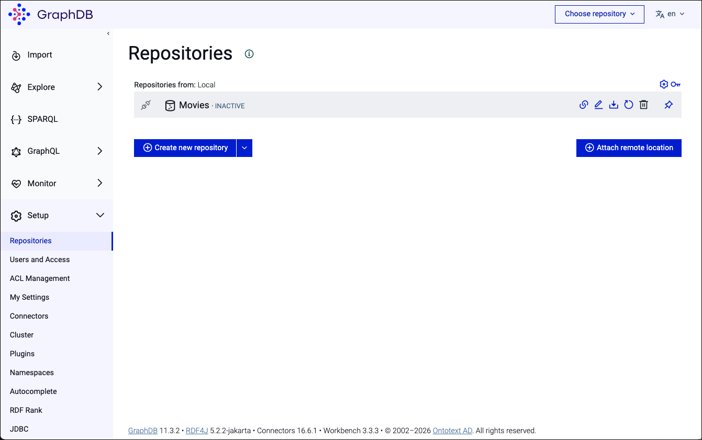

and click **Create**.

In the menu bar to the left, click on **Import**.

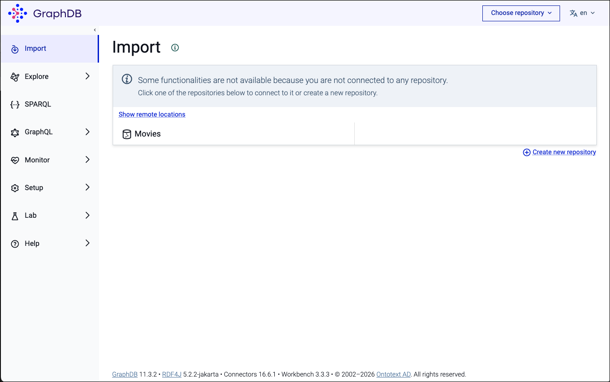

Click on **Movies** and select the 2nd option **Get RDF data from a URL**

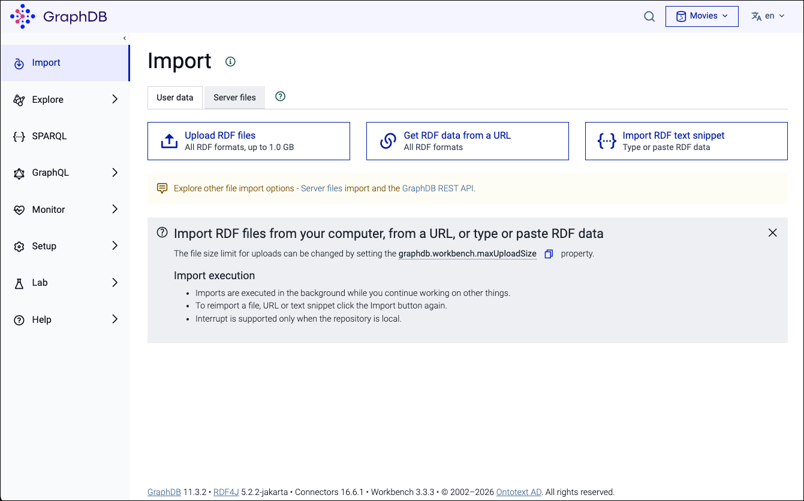

On the pop-up window enter [`https://raw.githubusercontent.com/gschmutz/nosql-workshop/master/07-working-with-graphdb/data/movies.ttl`](https://raw.githubusercontent.com/gschmutz/nosql-workshop/master/07-working-with-graphdb/data/movies.ttl) into the field

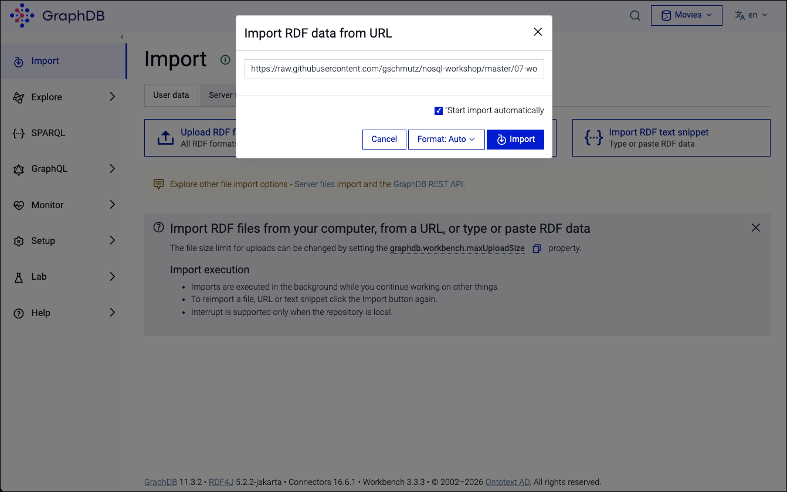

leave **Start import automatically** selected and click on **Import**. Leave the defaults on the other pop-up window and click **Import** again. 

After a few seconds the input should end with a successful message as shown in the following screenshot. 

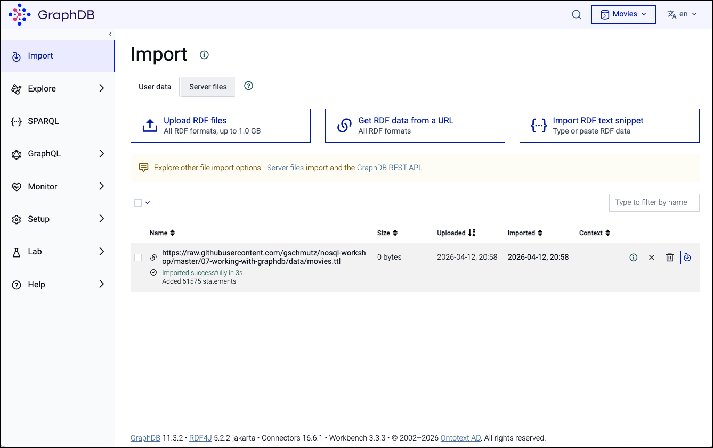

> **What you should see:** A green success banner showing the number of triples imported and the time taken. The `Movies` repository now appears as the active repository in the top-right corner of the workbench.

> **What just happened?** GraphDB fetched the Turtle file from GitHub, parsed every RDF triple, and stored them in the `Movies` repository. The data model — movies, actors, directors, and their relationships — is now fully queryable via SPARQL.

Now the database is ready to be used.

## Exploring the graph

Click on **Explore** and **Class hierarchy**

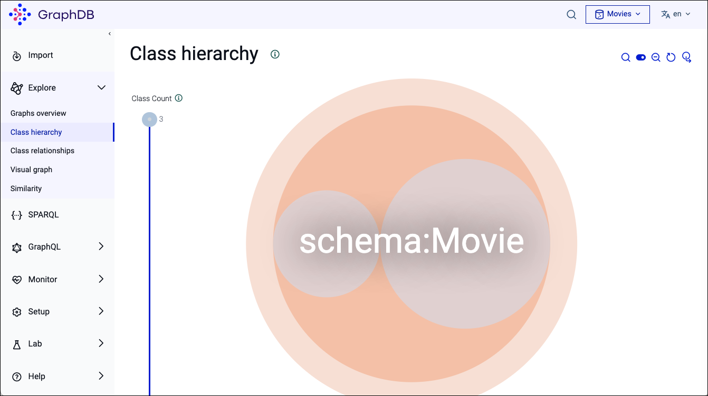

We can see the schema of the movies graph with the `schema:Movie` base class and the two subclasses `imdb:BlackAndWhiteMovie` and `imdb:ColorMovie`.

> **What you should see:** A circular "bubble" chart with nested rings. Each ring represents a class, sized proportionally to the number of instances. Hover over a ring to see the class name and instance count.

Click on the larger, inner circle, representing the color movies

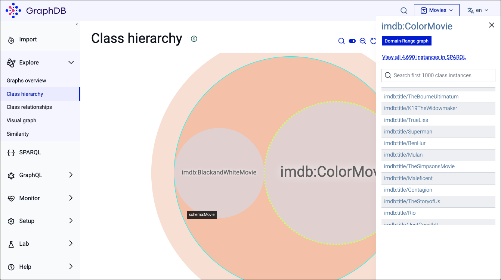

We can see that there are 4'690 instances of color movies in the graph, with a selection of a few movie titles displayed to the right. 

> **What you should see:** The right-hand panel updates to show `4690` instances and a sample list of movie titles belonging to `imdb:ColorMovie`.

You can either directly click on one of the titles shown or use the search to find a certain movie. Let's type in `matrix` 

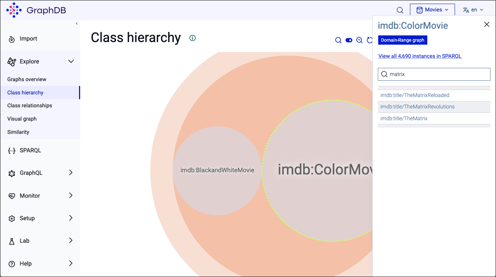

to find the movie **TheMatrix**. Click on it and you will see the triples listed belonging to this movie. 

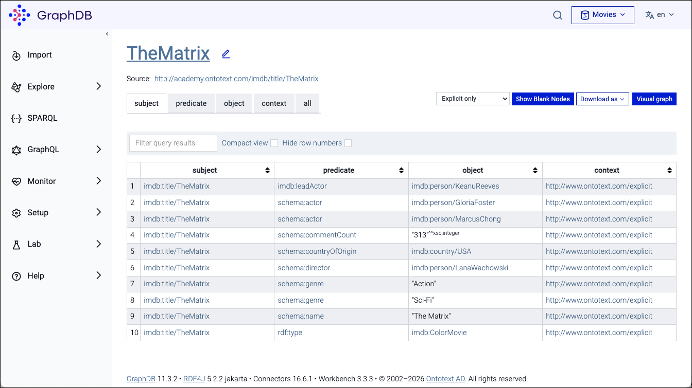

> **What you should see:** A table of RDF statements for **TheMatrix** — each row is one `predicate → object` pair, such as `schema:name → "The Matrix"`, `schema:director → imdb:person/LanaWachowski`, and links to its cast members. All IRIs are clickable and will navigate to that resource.

Click on **Visual Graph** to see the graph visually

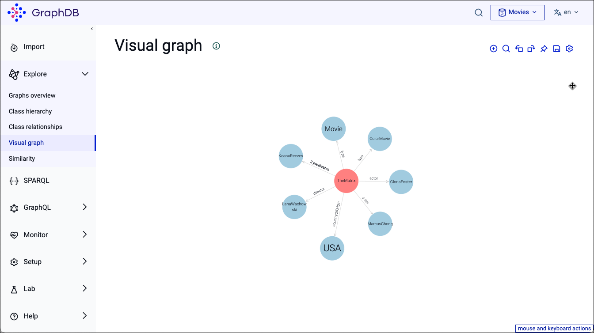

> **What you should see:** A radial graph with **TheMatrix** at the centre, surrounded by nodes for its director, lead actors, and other related resources — each connected by a labelled edge showing the predicate.

The beauty of the Visual Graph is that you can double click on one of the nodes to expand the graph. Let's try that on the Actor **KeanuReeves** and the graph should expand like shown below

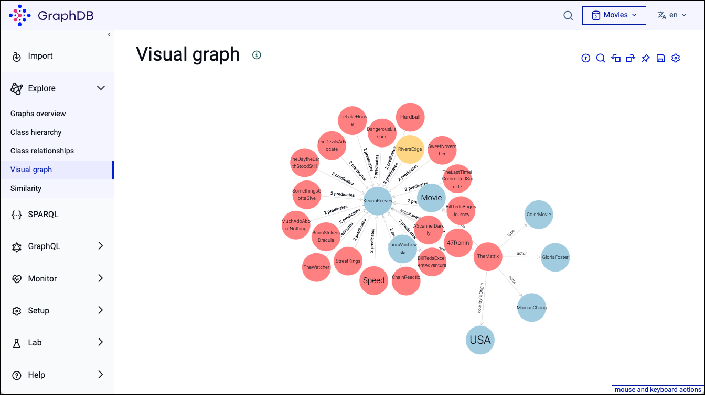

We can see all the other movies Keanu Reeves also acted in. 

> **What just happened?** GraphDB traversed all `imdb:leadActor` triples where the object is `imdb:person/KeanuReeves` and rendered each connected movie as a new node. This is live graph traversal — no query was written.

Navigating in the graph like that has some potential, but first we need to find a starting node in our graph. For that an RDF / Triple store offers the SPARQL query language.

## Querying the graph using SPARQL

Before querying, make sure the **Movies** repository is selected. You can see and change the active repository in the top-right corner of the workbench. If it shows a different repository, click the dropdown and select **Movies**.

Click on **SPARQL** in the navigation menu to the left and we will get to the SPARQL view which integrates the [YASGUI query editor](http://about.yasgui.org/).

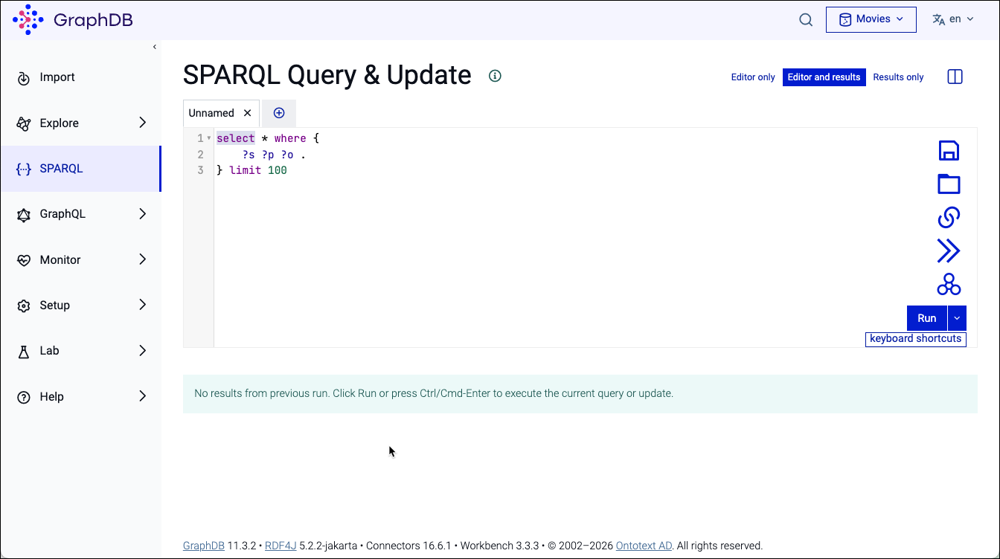

The most basic SPARQL select statement is pre-filled in the query window.

```sparql
select * where {
    ?s ?p ?o .
} limit 100
```

Click **Run** to run the query. It's selecting all the triples in the graph but limiting the result to 100 results. 

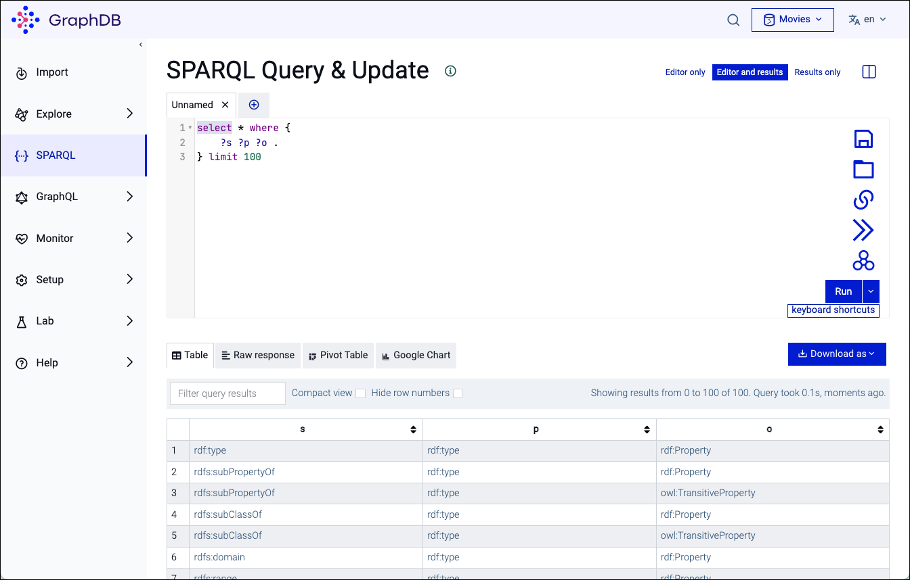

> **What you should see:** A results table with three columns — `s` (subject), `p` (predicate), and `o` (object) — showing 100 rows of raw triples from the repository. Subjects and predicates are rendered as clickable IRIs.

If we want to only show triples with a certain subject, we can adapt the query like that

```sparql
select * where {
    <http://academy.ontotext.com/imdb/title/PiratesoftheCaribbeanAtWorldsEnd> ?p ?o .
}
```

The query selects RDF statements whose subject is the movie Pirates of the Caribbean At World's End (identified by the IRI `http://academy.ontotext.com/imdb/title/PiratesoftheCaribbeanAtWorldsEnd`). 

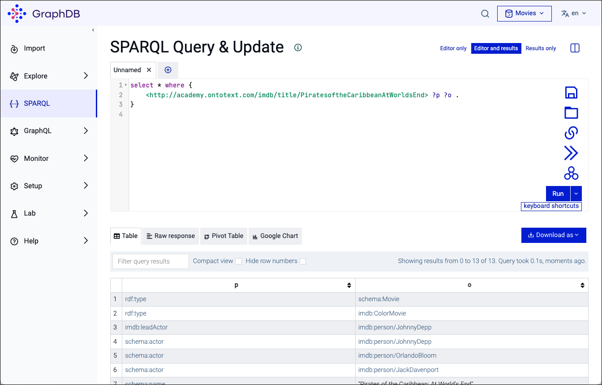

> **What you should see:** Only the triples for this one movie — its name, director, lead actors, comment count, and any other predicates stored for it. Every row shares the same subject IRI.

We can shorten the IRIs with setting a prefix like shown here

```sparql
PREFIX imdb: <http://academy.ontotext.com/imdb/>

select * where {
    imdb:title\/PiratesoftheCaribbeanAtWorldsEnd ?p ?o .
}
```

This is more useful if the same prefix is used multiple times.

Note that we need to escape the / in the shortened IRI.

The variables ?p and ?o correspond to the predicate and object of the RDF statements. We can see that the director (via the predicate `schema:director`) is identified by the IRI `imdb:person/GoreVerbinski` (scroll down if necessary).

> **What just happened?** By declaring `PREFIX imdb: <http://academy.ontotext.com/imdb/>` at the top, SPARQL lets you write `imdb:title\/PiratesoftheCaribbeanAtWorldsEnd` instead of the full IRI everywhere in the query. The result is identical — the prefix is purely a shorthand expanded at query time.


The next query selects all color movies by class (`a` is a short-hand notation for `rdf:type`) and then performs two joins to fetch the movie's name (via the `schema:name` predicate), and the movie's number of comments (via the `schema:commentCount` predicate). Finally, the result must be ordered by the number of comments in descending order.

```sparql
PREFIX imdb: <http://academy.ontotext.com/imdb/>
PREFIX schema: <http://schema.org/>

SELECT * { 
    ?movie a imdb:ColorMovie ;
           schema:name ?movieName ;
           schema:commentCount ?commentCount .
} ORDER BY DESC(?commentCount)
```

The table shows the results from executing the query.

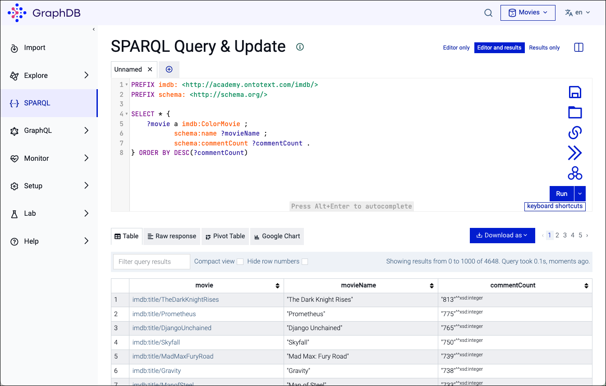

The variables `?movie`, `?movieName` and `?commentCount` contain each movie's IRI, name and number of comments respectively. We can see that the movie with the most comments, The Dark Knight Rises, comes on top.

> **What you should see:** A results table with columns `?movie`, `?movieName`, and `?commentCount`, ordered so that The Dark Knight Rises appears first.

> **What just happened?** SPARQL performed an implicit three-way join — it matched triples for class type (`a imdb:ColorMovie`), name (`schema:name`), and comment count (`schema:commentCount`), all sharing the same `?movie` subject — then sorted the full result set server-side before returning it.


The next query selects RDF statements that have the same subject (`?movie`) and the same object (`?person`). 
For any given movie and person, there must be RDF statements that link the movie and the person with both the `schema:director` and the `imdb:leadActor` predicate.

```sparql
PREFIX schema: <http://schema.org/>
PREFIX imdb: <http://academy.ontotext.com/imdb/>

SELECT * { 
	?movie schema:director ?person ;
           imdb:leadActor ?person .
} ORDER BY ?person
```

The table shows the results from executing the query.

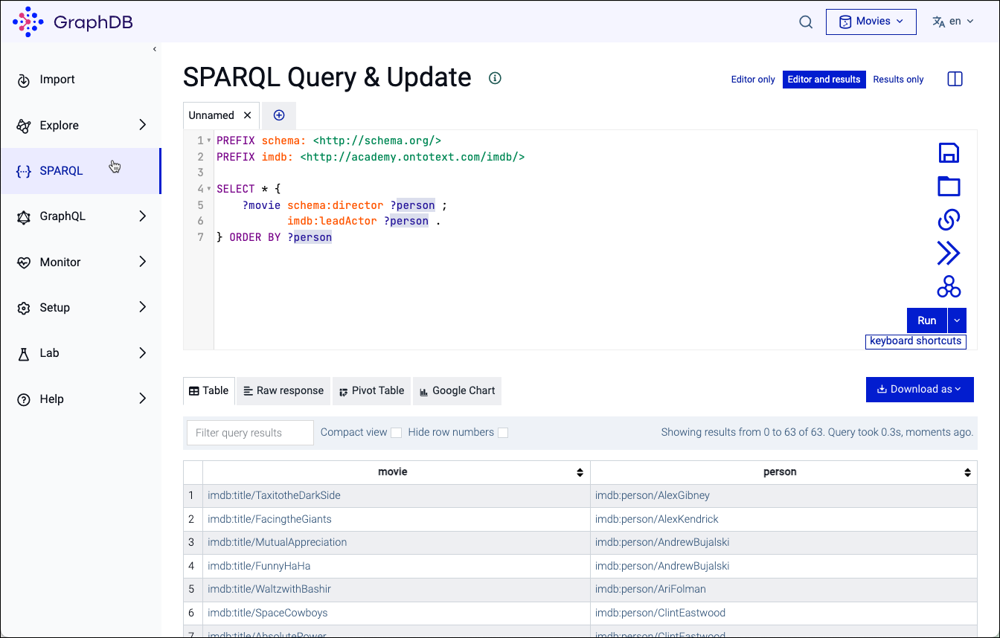

> **What you should see:** A list of movies and people where the same person is credited as both `schema:director` and `imdb:leadActor` — both the movie IRI and the person IRI are returned as separate columns.

> **What just happened?** SPARQL found all movies that have two RDF triples sharing the same subject (`?movie`) and the same object (`?person`) — one with `schema:director` and one with `imdb:leadActor`. This is a self-join on the graph: no explicit `JOIN` keyword needed, just shared variable names.

Just like the previous query, in the next query we select movies and people that are both the leading actor and the director. In this query, we also use `GROUP BY ?person` to group the results by person and `COUNT(?movie)` to count how many movies per person satisfy the criteria. The count is returned in the `?numMovies` variable.

```sparql
PREFIX schema: <http://schema.org/>
PREFIX imdb: <http://academy.ontotext.com/imdb/>

SELECT ?person (COUNT(?movie) as ?numMovies) { 
	?movie schema:director ?person ;
           imdb:leadActor ?person .
} GROUP BY ?person ORDER BY DESC(?numMovies)
```

The table shows the results from executing the query.

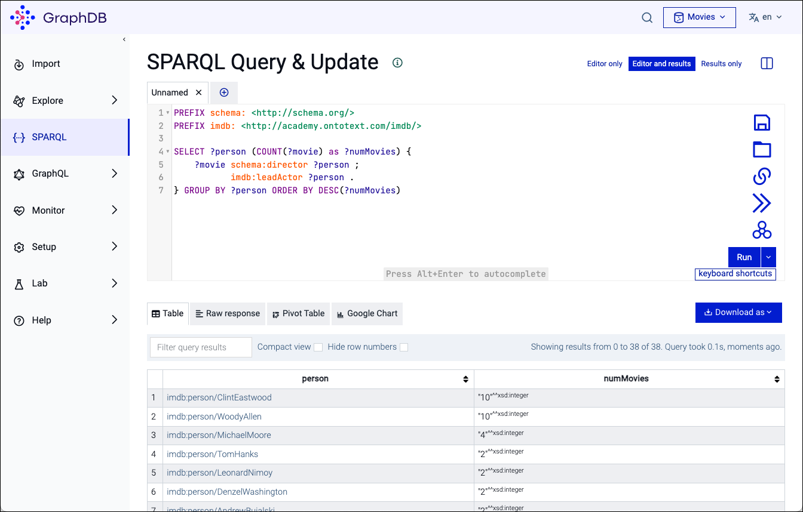

Since we also used `ORDER BY DESC(?numMovies)` to order the results by movie count in descending order, we can easily see that both Clint Eastwood and Woody Allen made 10 movies where they were the leading actor and the director.

> **What you should see:** A two-column table with `?person` (an IRI) and `?numMovies` (an integer), sorted descending. Clint Eastwood and Woody Allen appear at the top with 10 movies each.

> **What just happened?** `GROUP BY ?person` collapsed all rows with the same person into one, and `COUNT(?movie)` tallied the number of distinct movies per person — exactly like `GROUP BY` and `COUNT` in SQL, but operating over an RDF graph instead of a relational table.

### Filtering results with FILTER

The `FILTER` keyword restricts results to rows that satisfy a condition. The following query returns all color movies whose name contains the word "dark", using a case-insensitive regular expression:

```sparql
PREFIX imdb: <http://academy.ontotext.com/imdb/>
PREFIX schema: <http://schema.org/>

SELECT ?movie ?movieName ?commentCount {
    ?movie a imdb:ColorMovie ;
           schema:name ?movieName ;
           schema:commentCount ?commentCount .
    FILTER regex(?movieName, "dark", "i")
} ORDER BY DESC(?commentCount)
```

> **What you should see:** Only movies whose name matches "dark" (case-insensitively) — such as "The Dark Knight", "The Dark Knight Rises", and "Dark Shadows" — sorted by comment count descending.

> **What just happened?** `FILTER regex(?movieName, "dark", "i")` evaluated a regular expression against every bound value of `?movieName` and discarded rows that did not match, before `ORDER BY` was applied. The `"i"` flag makes the match case-insensitive.

You can also use numeric comparisons in `FILTER`. For example, to find highly-commented movies:

```sparql
PREFIX imdb: <http://academy.ontotext.com/imdb/>
PREFIX schema: <http://schema.org/>

SELECT ?movie ?movieName ?commentCount {
    ?movie a imdb:ColorMovie ;
           schema:name ?movieName ;
           schema:commentCount ?commentCount .
    FILTER (?commentCount > 500)
} ORDER BY DESC(?commentCount)
```

> **What you should see:** A much smaller result set than the full movie list — only movies where `?commentCount` exceeds 500, sorted by comment count descending.

### Handling optional data with OPTIONAL

Not every movie has all predicates populated. The `OPTIONAL` clause lets you include data that may or may not be present — rows where the optional pattern does not match are still returned, with the variable left unbound (empty).

The following query retrieves all movies along with their rating, if one exists:

```sparql
PREFIX imdb: <http://academy.ontotext.com/imdb/>
PREFIX schema: <http://schema.org/>

SELECT ?movieName ?rating ?commentCount {
    ?movie a imdb:ColorMovie ;
           schema:name ?movieName ;
           schema:commentCount ?commentCount .
    OPTIONAL { ?movie schema:ratingValue ?rating }
} ORDER BY DESC(?commentCount)
LIMIT 20
```

Movies that have no `schema:ratingValue` triple will still appear in the results, with `?rating` left blank.

> **What you should see:** The 20 most-commented color movies, with a `?rating` column that is populated for some movies and empty for others — but no rows are missing entirely.

> **What just happened?** SPARQL evaluated the `OPTIONAL { ... }` block for each row. Where a matching `schema:ratingValue` triple existed, `?rating` was bound; where it didn't, the row was kept anyway with `?rating` unbound. This is equivalent to a `LEFT OUTER JOIN` in SQL.

### Counting triples in the repository

To get a quick count of how many triples are stored in the active repository:

```sparql
SELECT (COUNT(*) AS ?tripleCount) {
    ?s ?p ?o .
}
```

This is a useful sanity check after loading data to confirm the import succeeded.

> **What you should see:** A single-row, single-column result containing one large integer — the total number of triples in the repository. For the Movies dataset this should be in the hundreds of thousands.

> **What just happened?** The pattern `?s ?p ?o` matches every triple in the repository. `COUNT(*)` counted them all and `AS ?tripleCount` gave the aggregate a readable name. This is the RDF equivalent of `SELECT COUNT(*) FROM table` in SQL.
