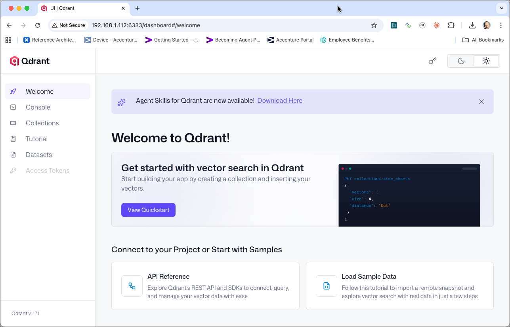
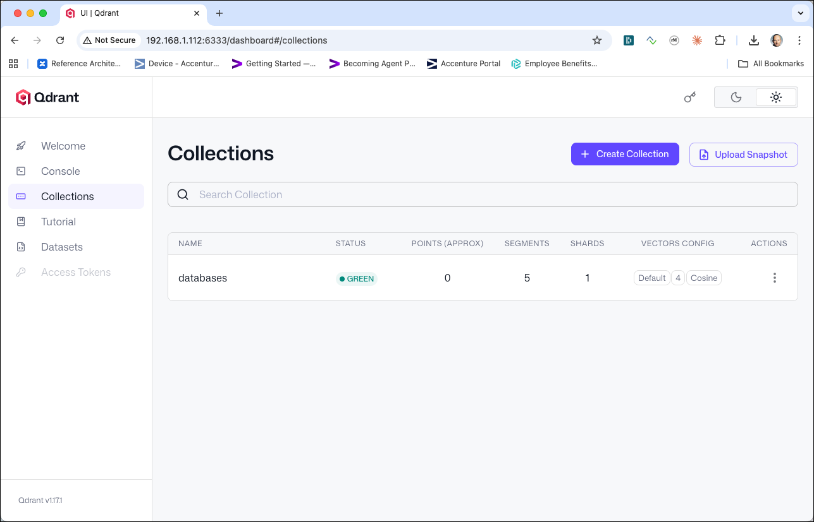

# Working with Qdrant

In this workshop we will learn how to use **Qdrant**, an AI-native vector database purpose-built for high-performance similarity search. We will use the Qdrant Dashboard, its REST API, and the official Python client from Jupyter to store and search vector embeddings.

## Table of Contents

- [What you will learn](#what-you-will-learn)
- [Prerequisites](#prerequisites)
- [Background: Vector Databases and Embeddings](#background-vector-databases-and-embeddings)
- [Accessing the Qdrant Dashboard](#accessing-the-qdrant-dashboard)
- [Working with Collections](#working-with-collections)
- [Inserting Points](#inserting-points)
- [Vector Similarity Search](#vector-similarity-search)
- [Filtered Similarity Search](#filtered-similarity-search)
- [Updating and Deleting Points](#updating-and-deleting-points)
- [Working with Qdrant from Python](#working-with-qdrant-from-python)

## What you will learn

- How vector databases differ from traditional NoSQL stores
- How to navigate the Qdrant Dashboard
- How to create and manage **collections** (the Qdrant equivalent of tables)
- How to insert **points** (vectors with metadata payloads)
- How to perform **vector similarity search** to find nearest neighbours
- How to narrow results using **payload filters**
- How to interact with Qdrant using the Python `qdrant-client` library from Jupyter

## Prerequisites

- The **Data Platform** described [here](../01-environment/README.md) is running and accessible

## Background: Vector Databases and Embeddings

Traditional databases store and retrieve data by exact match or range conditions. A vector database stores data as **high-dimensional numeric vectors** (called *embeddings*) and retrieves items by *geometric closeness* — finding the vectors that are most similar to a query vector.

A vector embedding is produced by a machine-learning model that encodes the *semantic meaning* of text, images, audio, or any other content into a fixed-length array of floating-point numbers. Two items that are semantically similar will have embeddings that are close together in that high-dimensional space.

The most common similarity metrics are:

| Metric | When to use |
|--------|-------------|
| **Cosine** | Comparing direction, not magnitude — ideal for text embeddings |
| **Dot product** | When embeddings are normalized; fastest inner-product search |
| **Euclidean** | When absolute distance matters (e.g. image feature spaces) |

In Qdrant, the unit of storage is a **point**, which consists of:

- **id** — a unique identifier (integer or UUID)
- **vector** — the embedding as an array of floats
- **payload** — an optional JSON object carrying any metadata you like (title, category, date, etc.)

Points are stored in a **collection**, which defines the vector size and distance metric.

## Accessing the Qdrant Dashboard

Open a browser and navigate to <http://dataplatform:6333/dashboard>.



The Dashboard lets you browse collections, inspect individual points, and run ad-hoc searches — all without writing any code.

## Working with Collections

A **collection** defines the vector space: every point in it must have a vector of the same size, and similarity is measured using the same distance metric throughout.

### Create a collection via the REST API

Qdrant exposes a full REST API at `http://dataplatform:6333`. Use `curl` to create a collection called `databases` whose vectors have **4 dimensions** and use **Cosine** similarity:

```bash
curl -X PUT http://dataplatform:6333/collections/databases \
  -H 'Content-Type: application/json' \
  -d '{
    "vectors": {
      "size": 4,
      "distance": "Cosine"
    }
  }'
```

```json
{"result":true,"status":"ok","time":0.003}
```

> **What you should see:** `"result": true` confirming the collection was created.

### List all collections

```bash
curl http://dataplatform:6333/collections
```

```json
{
  "result": {
    "collections": [
      {"name": "databases"}
    ]
  },
  "status": "ok",
  "time": 0.001
}
```

### Inspect the collection

```bash
curl http://dataplatform:6333/collections/databases | jq
```

```json
{
  "result": {
    "status": "green",
    "optimizer_status": "ok",
    "indexed_vectors_count": 0,
    "points_count": 0,
    "segments_count": 5,
    "config": {
      "params": {
        "vectors": {
          "size": 4,
          "distance": "Cosine"
        },
        "shard_number": 1,
        "replication_factor": 1,
        "write_consistency_factor": 1,
        "on_disk_payload": true
      },
      "hnsw_config": {
        "m": 16,
        "ef_construct": 100,
        "full_scan_threshold": 10000,
        "max_indexing_threads": 0,
        "on_disk": false
      },
      "optimizer_config": {
        "deleted_threshold": 0.2,
        "vacuum_min_vector_number": 1000,
        "default_segment_number": 0,
        "max_segment_size": null,
        "memmap_threshold": null,
        "indexing_threshold": 10000,
        "flush_interval_sec": 5,
        "max_optimization_threads": null,
        "prevent_unoptimized": null
      },
      "wal_config": {
        "wal_capacity_mb": 32,
        "wal_segments_ahead": 0,
        "wal_retain_closed": 1
      },
      "quantization_config": null
    },
    "payload_schema": {},
    "update_queue": {
      "length": 0
    }
  },
  "status": "ok",
  "time": 0.001559779
}
```

> **What you should see:** Collection metadata including `"points_count": 0` (no data yet) and the configured vector size of 4.

The collection is also visible in the Dashboard — refresh the page and it will appear in the list.



## Inserting Points

Our dataset represents well-known NoSQL and NewSQL databases. Each database is encoded as a 4-dimensional feature vector:

| Dimension | Meaning |
|-----------|---------|
| 0 | Write throughput (higher = faster writes) |
| 1 | Query flexibility (higher = richer query language) |
| 2 | Horizontal scalability (higher = scales out better) |
| 3 | Schema flexibility (higher = more schema-free) |

All values are in the range 0.0 – 1.0.

Use the `PUT /collections/{name}/points` endpoint to upsert (insert or update) a batch of points:

```bash
curl -X PUT http://dataplatform:6333/collections/databases/points \
  -H 'Content-Type: application/json' \
  -d '{
    "points": [
      {
        "id": 1,
        "vector": [0.98, 0.35, 0.65, 0.40],
        "payload": {"name": "Redis", "type": "key-value", "year": 2009}
      },
      {
        "id": 2,
        "vector": [0.75, 0.85, 0.80, 0.95],
        "payload": {"name": "MongoDB", "type": "document", "year": 2009}
      },
      {
        "id": 3,
        "vector": [0.92, 0.50, 0.98, 0.55],
        "payload": {"name": "Cassandra", "type": "wide-column", "year": 2008}
      },
      {
        "id": 4,
        "vector": [0.60, 0.90, 0.85, 0.70],
        "payload": {"name": "Elasticsearch", "type": "document", "year": 2010}
      },
      {
        "id": 5,
        "vector": [0.55, 0.95, 0.45, 0.75],
        "payload": {"name": "Neo4j", "type": "graph", "year": 2007}
      },
      {
        "id": 6,
        "vector": [0.88, 0.60, 0.70, 0.45],
        "payload": {"name": "InfluxDB", "type": "time-series", "year": 2013}
      },
      {
        "id": 7,
        "vector": [0.80, 0.70, 0.82, 0.60],
        "payload": {"name": "Qdrant", "type": "vector", "year": 2021}
      }
    ]
  }'
```

```json
{"result":{"operation_id":1,"status":"completed"},"status":"ok","time":0.012}
```

> **What you should see:** `"status": "completed"` — all 7 points were written successfully.

### Retrieve a point by ID

```bash
curl http://dataplatform:6333/collections/databases/points/1
```

```json
{
  "result": {
    "id": 1,
    "payload": {"name": "Redis", "type": "key-value", "year": 2009},
    "vector": [0.98, 0.35, 0.65, 0.40]
  },
  "status": "ok",
  "time": 0.001
}
```

### Retrieve multiple points by ID

```bash
curl -X POST http://dataplatform:6333/collections/databases/points \
  -H 'Content-Type: application/json' \
  -d '{"ids": [1, 3, 5]}'
```

```json
{
  "result": [
    {"id": 1, "payload": {"name": "Redis",     "type": "key-value",  "year": 2009}, "vector": null},
    {"id": 3, "payload": {"name": "Cassandra", "type": "wide-column","year": 2008}, "vector": null},
    {"id": 5, "payload": {"name": "Neo4j",     "type": "graph",      "year": 2007}, "vector": null}
  ],
  "status": "ok",
  "time": 0.002
}
```

> **What you should see:** The three requested points with their payloads. Vectors are omitted by default (`null`) to keep responses compact — add `"with_vector": true` to the request body to include them.

The Dashboard will now show the collection with 7 points under the **Collections** tab.


## Vector Similarity Search

The core operation of a vector database is the **k-nearest-neighbour (kNN) search**: given a query vector, return the `k` most similar points.

Imagine we are looking for a database with characteristics similar to Redis — very high write throughput (`0.95`), low query flexibility (`0.30`), moderate horizontal scalability (`0.70`), and low schema flexibility (`0.45`). We encode those requirements as a query vector and ask Qdrant to find the closest matches:

```bash
curl -X POST http://dataplatform:6333/collections/databases/points/search \
  -H 'Content-Type: application/json' \
  -d '{
    "vector": [0.95, 0.30, 0.70, 0.45],
    "limit": 3,
    "with_payload": true
  }'
```

```json
{
  "result": [
    {
      "id": 1,
      "version": 0,
      "score": 0.9995,
      "payload": {"name": "Redis", "type": "key-value", "year": 2009}
    },
    {
      "id": 6,
      "version": 0,
      "score": 0.9903,
      "payload": {"name": "InfluxDB", "type": "time-series", "year": 2013}
    },
    {
      "id": 3,
      "version": 0,
      "score": 0.9831,
      "payload": {"name": "Cassandra", "type": "wide-column", "year": 2008}
    }
  ],
  "status": "ok",
  "time": 0.003
}
```

> **What you should see:** The three databases whose feature vectors are closest (by Cosine similarity) to the query. Redis scores highest — its vector `[0.98, 0.35, 0.65, 0.40]` is very close to the query `[0.95, 0.30, 0.70, 0.45]`. InfluxDB and Cassandra follow because they also have high write throughput.
>
> **What just happened?** Qdrant compared the query vector against all 7 stored vectors using Cosine similarity (a measure of the angle between vectors), ranked them, and returned the top 3. No exact match on any field was required — the results reflect *geometric closeness* in the feature space.

### Searching with a score threshold

You can require a minimum similarity score using `score_threshold` to avoid returning irrelevant results:

```bash
curl -X POST http://dataplatform:6333/collections/databases/points/search \
  -H 'Content-Type: application/json' \
  -d '{
    "vector": [0.95, 0.30, 0.70, 0.45],
    "limit": 10,
    "score_threshold": 0.99,
    "with_payload": true
  }'
```

```json
{
  "result": [
    {
      "id": 1,
      "score": 0.9995,
      "payload": {"name": "Redis", "type": "key-value", "year": 2009}
    }
  ],
  "status": "ok",
  "time": 0.002
}
```

> **What you should see:** Only Redis is returned — it is the only database scoring above `0.99`. The others were filtered out by the threshold before being returned.

## Filtered Similarity Search

Qdrant can combine vector search with payload filters in a single query — it is not a two-step process. The filter is applied *during* the vector scan, so only matching points are considered as candidates.

### Filter by exact match

Find the most query-flexible database (`high dimension 1`) but only within the `document` type:

```bash
curl -X POST http://dataplatform:6333/collections/databases/points/search \
  -H 'Content-Type: application/json' \
  -d '{
    "vector": [0.50, 0.95, 0.80, 0.80],
    "limit": 3,
    "with_payload": true,
    "filter": {
      "must": [
        {
          "key": "type",
          "match": {"value": "document"}
        }
      ]
    }
  }'
```

```json
{
  "result": [
    {
      "id": 4,
      "score": 0.9912,
      "payload": {"name": "Elasticsearch", "type": "document", "year": 2010}
    },
    {
      "id": 2,
      "score": 0.9704,
      "payload": {"name": "MongoDB", "type": "document", "year": 2009}
    }
  ],
  "status": "ok",
  "time": 0.002
}
```

> **What you should see:** Only the two databases with `"type": "document"` are returned, ranked by similarity to the query. Elasticsearch scores higher because its feature vector aligns better with the query's high query-flexibility profile.

### Filter by range condition

Find databases released after 2009, ranked by similarity to a high-scalability profile:

```bash
curl -X POST http://dataplatform:6333/collections/databases/points/search \
  -H 'Content-Type: application/json' \
  -d '{
    "vector": [0.70, 0.70, 0.95, 0.65],
    "limit": 5,
    "with_payload": true,
    "filter": {
      "must": [
        {
          "key": "year",
          "range": {"gt": 2009}
        }
      ]
    }
  }'
```

```json
{
  "result": [
    {
      "id": 7,
      "score": 0.9942,
      "payload": {"name": "Qdrant", "type": "vector", "year": 2021}
    },
    {
      "id": 4,
      "score": 0.9871,
      "payload": {"name": "Elasticsearch", "type": "document", "year": 2010}
    },
    {
      "id": 6,
      "score": 0.9822,
      "payload": {"name": "InfluxDB", "type": "time-series", "year": 2013}
    }
  ],
  "status": "ok",
  "time": 0.002
}
```

> **What you should see:** Only databases with `year > 2009` are candidates. Qdrant (2021) scores highest because its feature vector most closely matches the high-scalability query.

### Filter with must_not (exclusion)

Search for the fastest-writing databases but exclude key-value stores:

```bash
curl -X POST http://dataplatform:6333/collections/databases/points/search \
  -H 'Content-Type: application/json' \
  -d '{
    "vector": [0.98, 0.40, 0.80, 0.50],
    "limit": 3,
    "with_payload": true,
    "filter": {
      "must_not": [
        {
          "key": "type",
          "match": {"value": "key-value"}
        }
      ]
    }
  }'
```

```json
{
  "result": [
    {
      "id": 3,
      "score": 0.9963,
      "payload": {"name": "Cassandra", "type": "wide-column", "year": 2008}
    },
    {
      "id": 6,
      "score": 0.9901,
      "payload": {"name": "InfluxDB", "type": "time-series", "year": 2013}
    },
    {
      "id": 7,
      "score": 0.9845,
      "payload": {"name": "Qdrant", "type": "vector", "year": 2021}
    }
  ],
  "status": "ok",
  "time": 0.002
}
```

> **What you should see:** Redis (id=1, type=key-value) is excluded by the `must_not` clause. Cassandra now ranks first because it has the highest write throughput among the remaining candidates.

## Updating and Deleting Points

### Update a payload field

Use `POST /collections/{name}/points/payload` to add or overwrite payload fields without replacing the entire point:

```bash
curl -X POST http://dataplatform:6333/collections/databases/points/payload \
  -H 'Content-Type: application/json' \
  -d '{
    "payload": {"open_source": true},
    "points": [1, 2, 3, 4, 5, 6, 7]
  }'
```

```json
{"result":{"operation_id":2,"status":"completed"},"status":"ok","time":0.004}
```

### Delete points by filter

Delete all points of type `graph`:

```bash
curl -X POST http://dataplatform:6333/collections/databases/points/delete \
  -H 'Content-Type: application/json' \
  -d '{
    "filter": {
      "must": [
        {"key": "type", "match": {"value": "graph"}}
      ]
    }
  }'
```

```json
{"result":{"operation_id":3,"status":"completed"},"status":"ok","time":0.003}
```

> **What you should see:** `"status": "completed"`. Neo4j (the only graph-type point) has been removed. The collection now has 6 points.

## Working with Qdrant from Python

The official Python client is `qdrant-client`. In this section we will connect to Qdrant from the **Jupyter** environment and work through the same operations we performed via the REST API.

Open a browser and navigate to <http://dataplatform:28888>. Create a new Python 3 notebook and work through the cells below in order.

### Cell 1 — Install the library

```python
import sys
!{sys.executable} -m pip install qdrant-client
```

> **What you should see:** pip output ending with `Successfully installed qdrant-client-...`.

### Cell 2 — Connect to Qdrant

```python
from qdrant_client import QdrantClient

client = QdrantClient(host="qdrant", port=6333)
client.get_collections()
```

> **What you should see:** A `CollectionsResponse` object listing any collections that already exist (including `databases` if you ran the REST API section).

### Cell 3 — Create a collection

```python
from qdrant_client.models import Distance, VectorParams

client.recreate_collection(
    collection_name="tech_articles",
    vectors_config=VectorParams(size=4, distance=Distance.COSINE),
)
client.get_collection("tech_articles")
```

> **What you should see:** A `CollectionInfo` object with `status='green'`, `vectors_count=0`, and `points_count=0`.
>
> **Note:** `recreate_collection` drops and recreates the collection if it already exists — useful for iterating during development.

### Cell 4 — Insert points

```python
from qdrant_client.models import PointStruct

points = [
    PointStruct(id=1, vector=[0.98, 0.35, 0.65, 0.40],
                payload={"name": "Redis",         "type": "key-value",  "year": 2009}),
    PointStruct(id=2, vector=[0.75, 0.85, 0.80, 0.95],
                payload={"name": "MongoDB",        "type": "document",   "year": 2009}),
    PointStruct(id=3, vector=[0.92, 0.50, 0.98, 0.55],
                payload={"name": "Cassandra",      "type": "wide-column","year": 2008}),
    PointStruct(id=4, vector=[0.60, 0.90, 0.85, 0.70],
                payload={"name": "Elasticsearch",  "type": "document",   "year": 2010}),
    PointStruct(id=5, vector=[0.55, 0.95, 0.45, 0.75],
                payload={"name": "Neo4j",          "type": "graph",      "year": 2007}),
    PointStruct(id=6, vector=[0.88, 0.60, 0.70, 0.45],
                payload={"name": "InfluxDB",       "type": "time-series","year": 2013}),
    PointStruct(id=7, vector=[0.80, 0.70, 0.82, 0.60],
                payload={"name": "Qdrant",         "type": "vector",     "year": 2021}),
]

client.upsert(collection_name="tech_articles", points=points)
print(client.get_collection("tech_articles").points_count)
```

> **What you should see:** `7` — all points were inserted successfully.

### Cell 5 — Vector similarity search

```python
results = client.search(
    collection_name="tech_articles",
    query_vector=[0.95, 0.30, 0.70, 0.45],
    limit=3,
)

for hit in results:
    print(f"{hit.score:.4f}  {hit.payload['name']} ({hit.payload['type']})")
```

```
0.9995  Redis (key-value)
0.9903  InfluxDB (time-series)
0.9831  Cassandra (wide-column)
```

> **What you should see:** The three databases whose feature profiles are closest to the query. Redis should rank first.

### Cell 6 — Filtered similarity search

```python
from qdrant_client.models import Filter, FieldCondition, MatchValue

results = client.search(
    collection_name="tech_articles",
    query_vector=[0.50, 0.95, 0.80, 0.80],
    query_filter=Filter(
        must=[
            FieldCondition(key="type", match=MatchValue(value="document"))
        ]
    ),
    limit=5,
)

for hit in results:
    print(f"{hit.score:.4f}  {hit.payload['name']} (year: {hit.payload['year']})")
```

```
0.9912  Elasticsearch (year: 2010)
0.9704  MongoDB (year: 2009)
```

> **What you should see:** Only document-type databases are returned. The filter is applied inside the vector scan — not as a post-processing step.

### Cell 7 — Range filter

```python
from qdrant_client.models import Range

results = client.search(
    collection_name="tech_articles",
    query_vector=[0.70, 0.70, 0.95, 0.65],
    query_filter=Filter(
        must=[
            FieldCondition(key="year", range=Range(gt=2009))
        ]
    ),
    limit=5,
)

for hit in results:
    print(f"{hit.score:.4f}  {hit.payload['name']} (year: {hit.payload['year']})")
```

```
0.9942  Qdrant (year: 2021)
0.9871  Elasticsearch (year: 2010)
0.9822  InfluxDB (year: 2013)
```

> **What you should see:** Only databases released after 2009 appear. Qdrant (2021) ranks first because it most closely matches the high-scalability query profile.

### Cell 8 — Scroll through all points

The `scroll` API lets you page through all points in a collection without needing a query vector — useful for inspection or bulk export:

```python
points, next_offset = client.scroll(
    collection_name="tech_articles",
    with_payload=True,
    with_vectors=False,
    limit=10,
)

for p in points:
    print(f"id={p.id:2d}  {p.payload['name']:<16} type={p.payload['type']}")
```

```
id= 1  Redis            type=key-value
id= 2  MongoDB          type=document
id= 3  Cassandra        type=wide-column
id= 4  Elasticsearch    type=document
id= 5  Neo4j            type=graph
id= 6  InfluxDB         type=time-series
id= 7  Qdrant           type=vector
```

> **What you should see:** All 7 points listed in insertion order.

### Cell 9 — Update a payload field

Add an `open_source` flag to all points:

```python
from qdrant_client.models import SetPayload

client.set_payload(
    collection_name="tech_articles",
    payload={"open_source": True},
    points=[1, 2, 3, 4, 5, 6, 7],
)

# Verify
point = client.retrieve(
    collection_name="tech_articles",
    ids=[1],
    with_payload=True,
)[0]
print(point.payload)
```

```
{'name': 'Redis', 'type': 'key-value', 'year': 2009, 'open_source': True}
```

> **What you should see:** The payload now includes the new `open_source` field alongside the original fields.

### Cell 10 — Delete points by filter

```python
from qdrant_client.models import FilterSelector

client.delete(
    collection_name="tech_articles",
    points_selector=FilterSelector(
        filter=Filter(
            must=[
                FieldCondition(key="type", match=MatchValue(value="graph"))
            ]
        )
    ),
)

print(client.get_collection("tech_articles").points_count)
```

```
6
```

> **What you should see:** `6` — Neo4j (the only graph-type point) was deleted, leaving 6 points.

### Cell 11 — Cleaning up

Delete the collection created in this notebook:

```python
client.delete_collection("tech_articles")
print(client.get_collections())
```

> **What you should see:** A `CollectionsResponse` where `tech_articles` no longer appears in the list.
